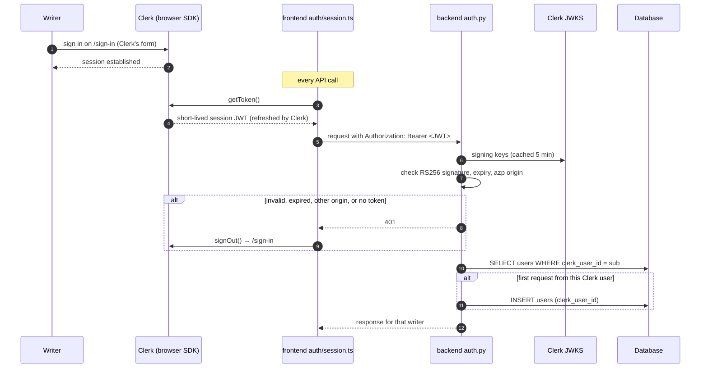

# Authentication

Maya does not handle passwords, sessions or email verification.
[Clerk](https://clerk.com) owns identity: sign-up, sign-in, the session, the email address and the account settings.
Maya owns everything a writer makes, keyed by the Clerk user id.

The split is deliberate.
Account security (breached-password checks, new-device verification, session revocation, social login) is a product in itself, and it is Clerk's.
Maya's backend only has to answer one question on each request: which Clerk user sent this, if any.

## How a request is authenticated

### Backend: `backend/auth.py`

`get_current_user` is the FastAPI dependency every protected route uses, directly or through `require_project`.
It does two things.

**`verify_session(request)`** checks the session token with Clerk's Python SDK (`clerk-backend-api`) and returns the token's subject, the Clerk user id (`user_...`), or `None`.
- The signature is RS256, checked against Clerk's JWKS, which the SDK fetches with `CLERK_SECRET_KEY` and caches for five minutes.
  Set `CLERK_JWT_KEY` to the PEM public key from the Clerk dashboard and verification needs no network call at all.
- Expiry and not-before are enforced, with Clerk's default five seconds of clock skew.
- The `azp` claim, the origin the token was minted for, must be in `CLERK_AUTHORIZED_PARTIES`.
  A token issued to another site on the same Clerk instance is refused.
- Only session tokens are accepted; Clerk API keys and machine tokens are not.

**`get_or_create_user(db, clerk_user_id)`** returns the writer's row, and creates it on their first authenticated request.
There is no Clerk webhook to keep in sync: a user exists in Maya as soon as they use it.
Two first requests racing each other both try the insert; the unique index on `clerk_user_id` lets one win, and the other reads the winner's row.

Any failure is a `401` with `WWW-Authenticate: Bearer`.
A project id the caller does not own is a `404`, not a `403`, so someone else's project is indistinguishable from one that never existed.

### The `users` row

| Column | What it is |
|---|---|
| `id` | Maya's own UUID. Every foreign key (projects, usage) points here, never at Clerk. |
| `clerk_user_id` | The token's `sub`. Unique. |
| `model_key` | The model the writer generates with. |
| `monthly_budget_micro_usd` | Optional per-writer override of the AI budget. |

No email, name or password is stored.
Where Maya needs the email, it asks Clerk: the browser reads it from `useUser()`, and the backend would call Clerk's API.
A copy would go stale the moment a writer changed their address in Clerk.

### Frontend

- **`auth/ClerkWithRouter.tsx`** mounts `ClerkProvider` inside the router, and gives it React Router's `navigate`, so Clerk's own redirects stay client-side.
  It fails at startup if `VITE_CLERK_PUBLISHABLE_KEY` is missing.
- **`/sign-in/*` and `/sign-up/*`** render Clerk's `<SignIn>` and `<SignUp>` beside Maya's branded panel (`screens/AuthScreen.tsx`).
  The `/*` matters: Clerk's multi-step flows live on sub-paths such as `/sign-in/factor-one` and `/sign-up/verify-email-address`.
- **`auth/session.ts`** is how the non-React API layer (`api/client.ts`, `api/stream.ts`) gets a token.
  It calls Clerk's standalone `getToken()`, which waits for Clerk to load, so the first request of a page never races Clerk.
  Nothing is kept in `localStorage`.
- **A `401`** from the backend calls the handler `RequireAuth` registers, which signs out through Clerk.
- **`App`** clears the React Query cache whenever the signed-in user id changes, so one account's data is never shown to the next.
- **The account menu** shows the email from Clerk, and offers *Manage account* (Clerk's profile modal: email, password, sessions, connected accounts) and *Log out*.

## Configuration

| Variable | Where | Required | Purpose |
|---|---|---|---|
| `CLERK_SECRET_KEY` | backend | yes | Fetches the JWKS; calls Clerk's API. The backend refuses to start without it. |
| `VITE_CLERK_PUBLISHABLE_KEY` | frontend | yes | Loads Clerk in the browser. Public by design. |
| `CLERK_AUTHORIZED_PARTIES` | backend | in production | Comma-separated origins tokens may come from. Defaults to `http://localhost:5173,http://localhost:8000`. |
| `CLERK_JWT_KEY` | backend | no | PEM public key; verifies tokens without fetching the JWKS. |

All of them live in the one `.env` at the repo root: Vite reads it too (`envDir: '..'`) and exposes only the `VITE_*` keys to the browser.

## Local development

`make seed` creates the demo writer in Clerk and gives them a sample project.

- Sign in as **demo+clerk_test@example.com** / **salt-road-weighing-house**.
- The `+clerk_test` makes it a Clerk test address: on a development instance, any email code Clerk asks for (a new-device check, a verification) is **424242**.
  Use the same trick for any throwaway account you sign up with.
- Clerk checks passwords at sign-in against its length rule and against known breaches, even for accounts created through the API.
  The seed therefore lets Clerk validate the password up front and stops with Clerk's reason if it is refused.

Re-running `make seed` reuses the Clerk user, resets its password and replaces the demo project.

## Tests

- **`tests/conftest.py`** replaces only `verify_session` with a stand-in that reads the bearer token as the Clerk user id.
  Everything after it runs for real: creating the user, ownership checks, budgets.
  A test signs in as someone with `Authorization: Bearer user_whoever`.
- **`tests/test_auth.py`** tests the real verification.
  It generates an RSA key, signs tokens with it, and points `CLERK_JWT_KEY` at the public half: a valid token passes, and an expired, wrongly signed, other-origin or malformed one is a `401`.
- **The frontend** mocks `@clerk/react` once, in `src/test/clerk.ts`, installed by `src/test/setup.ts`.
  Tests steer it through the exported `clerk` object: who is signed in, and which token the API calls carry.

## Operations

- **Raising one writer's budget:** find their `user_...` id in the Clerk dashboard, then `UPDATE users SET monthly_budget_micro_usd = 20000000 WHERE clerk_user_id = 'user_...';` (micro-dollars: that is $20).
- **Deleting a writer in Clerk** signs them out everywhere, and their next request is refused.
  Their Maya row and projects stay in the database until removed by hand; nothing listens for Clerk's `user.deleted` yet.
- **Going to production:** create a production instance in Clerk, use its `pk_live_` and `sk_live_` keys, and set `CLERK_AUTHORIZED_PARTIES` to the public URL.
  Development instances are rate-limited and show a "Development mode" badge.
- **Rotating the secret key** in Clerk only needs `CLERK_SECRET_KEY` updated and a restart: sessions are unaffected, because tokens are signed with Clerk's key pair, not with the secret.
