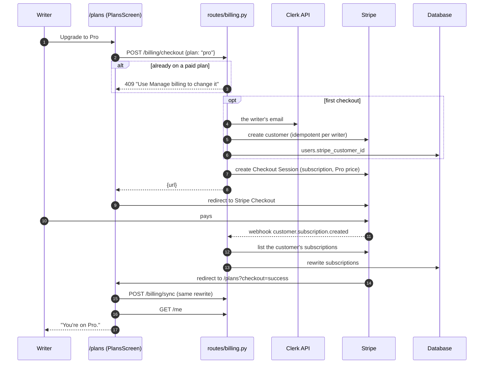
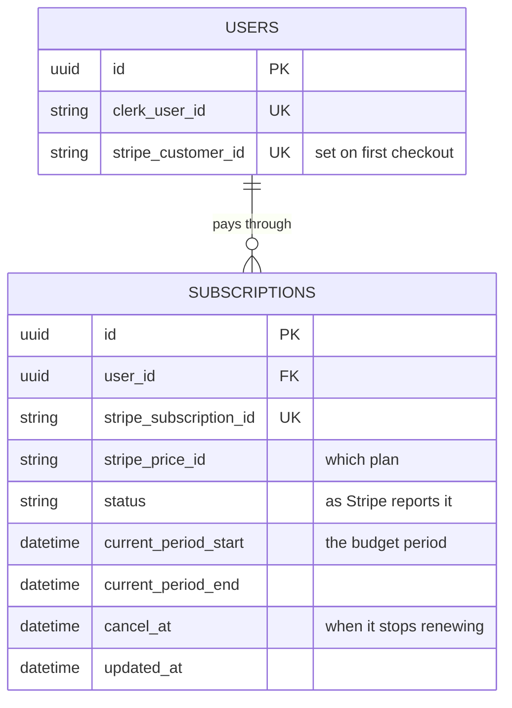

# Plans and billing

Every writer is on a plan, and a plan is an AI budget.
**Free** needs no card.
**Starter**, **Pro** and **Studio** are monthly Stripe subscriptions.
Every plan has every feature and all three models; they differ only in how much AI use each period includes.

| Plan | Price | AI budget per period (default) | Budget setting |
|---|---|---|---|
| Free | $0 | $5 | `MONTHLY_BUDGET_USD` |
| Starter | $20 / month | $10 | `PLAN_STARTER_BUDGET_USD` |
| Pro | $50 / month | $25 | `PLAN_PRO_BUDGET_USD` |
| Studio | $100 / month | $50 | `PLAN_STUDIO_BUDGET_USD` |

A plan's budget is its own setting, not its price.
The default of half the price leaves room for Stripe's fees and hosting, and the margin can be tuned without a deploy.
The prices shown are for display (`backend/plans.py`) and must match the prices in Stripe.

Billing is optional.
Without `STRIPE_SECRET_KEY` every writer is on Free, the plans page lists Free alone, and checkout answers `503`.
A paid plan is offered only once its `STRIPE_PRICE_<PLAN>` is set.

## The rules

**A plan is paid for while Stripe reports its subscription `active` or `trialing`, within its current billing period.**
Everything else follows from that line (`PAID_STATUSES` and `entitlement()` in `backend/usage.py`).

| Situation | Stripe says | Plan in effect |
|---|---|---|
| Subscribed and paid | `active` | The paid plan |
| Cancelled "at period end" | `active`, with `cancel_at` | The paid plan until `cancel_at`, then Free. The plans page shows "Ends <date>, then Free". |
| Period over, subscription ended | `canceled` | Free |
| Renewal payment failed | `past_due` | Free. The payment that failed was for the period just starting, so the paid period has already ended. A later successful retry makes it `active` again, and the plan returns. |
| First payment never completed | `incomplete` | Free |
| Price no longer offered | any | Free: a subscription only counts if its price is one of the plans on offer. |
| Two live subscriptions (should not happen) | `active` ×2 | The one with the larger budget. Both are billed, so both are kept. |

**The budget period** is where spend is summed from.
- On a paid plan it is the Stripe billing period, so the budget resets on the day the writer is charged.
  Someone who subscribes on the 20th has their full budget until the next 20th.
- On Free it is the calendar month in UTC.

**A per-writer override** (`users.monthly_budget_micro_usd`) replaces the plan's budget, whatever the plan.

The budget is enforced the same way on every plan (see *Model choice and the AI budget* in the README).
A generation is refused with `402` once the period's spend reaches the budget.
When a larger plan exists, the refusal adds "Upgrade your plan to keep going now", and the editor's meter turns into an **Upgrade** link to `/plans`.

## Stripe is the source of truth

Maya never decides what a writer pays for; it copies it from Stripe.

`sync_customer()` in `backend/billing.py` lists all of a customer's subscriptions from Stripe as they are now, and rewrites the `subscriptions` rows from them.
It is the only code that writes that table, and it is called from two places:

- **The webhook**, `POST /billing/webhook`, for every `customer.subscription.*` event.
  The event only says *which customer* changed; the state comes from Stripe's API.
  Events that arrive late, twice or out of order therefore cannot leave a writer on the wrong plan.
- **The return from checkout**, `POST /billing/sync`, which the plans page calls on `?checkout=success`.
  The writer sees their new plan at once, even if the webhook has not landed yet.

The period and price are read from the subscription's item, not the subscription: since Stripe API version 2025-03-31 that is where they live.
A cancellation shows up either as `cancel_at` or as `cancel_at_period_end`, depending on how it was made; both are stored as `cancel_at`.

## Flows

### Upgrading



The customer is created with an idempotency key per writer, so two checkouts started at once share one customer.
Checkout allows promotion codes, which is how beta discounts can be handed out from the Stripe dashboard.

### Changing plan, updating the card, cancelling

Subscribers do all of this in Stripe's billing portal: **Manage billing** on the plans page calls `POST /billing/portal`, which returns a portal session URL that comes back to `/plans`.
The portal is configured in Stripe to allow switching between the three prices (prorated), cancelling at the end of the period, updating the payment method and seeing invoices.
Each change reaches Maya as a `customer.subscription.updated` or `.deleted` webhook, and the sync above.

Checkout refuses a second paid plan with `409`: a second subscription would bill twice, where the portal swaps the price on the existing one.

### The plans page

`/plans` (from **Plan & billing** in the account menu) lists `GET /billing/plans` with the current plan from `GET /me`.

- A Free writer sees **Upgrade to …** on each paid plan.
- A subscriber sees **Manage billing** on their plan, and **Switch in billing** or **Cancel in billing** on the others, all of which open the portal.
- On `?checkout=success` it runs the sync once as a query, refetches `/me` (cancelling any first load of it already in flight, which would predate the sync), confirms the new plan and drops the query string.

## API

| Route | Auth | Purpose |
|---|---|---|
| `GET /billing/plans` | writer | Free, then each paid plan on offer: key, label, price, budget. |
| `POST /billing/checkout` | writer | `{plan}` → `{url}` of a Stripe Checkout page. `422` unknown plan, `409` already paid, `503` billing off. |
| `POST /billing/portal` | writer | `{url}` of the billing portal. `409` if the writer has never checked out. |
| `POST /billing/sync` | writer | Re-read the writer's subscriptions from Stripe. `204`. |
| `POST /billing/webhook` | Stripe signature | `customer.subscription.*` → sync that customer. Anything else, or a customer Maya does not know, is acknowledged and ignored. `400` on a bad signature. |
| `GET /me` | writer | Includes `plan: {key, label, ends_at}`, and `usage` over the current budget period. |

## Data



One row per Stripe subscription, not per writer, so an ended subscription and its replacement can sit side by side.

## Configuration

| Variable | Purpose |
|---|---|
| `STRIPE_SECRET_KEY` | Turns billing on. `sk_test_…` in development. |
| `STRIPE_WEBHOOK_SECRET` | Verifies webhook signatures. Printed by `stripe listen` locally; shown on the endpoint's page in the dashboard in production. |
| `STRIPE_PRICE_STARTER`, `STRIPE_PRICE_PRO`, `STRIPE_PRICE_STUDIO` | Each plan's monthly price id (`price_…`). A plan without one is not offered. |
| `PLAN_STARTER_BUDGET_USD`, `PLAN_PRO_BUDGET_USD`, `PLAN_STUDIO_BUDGET_USD` | Each plan's AI budget. Default: half the price. |
| `MONTHLY_BUDGET_USD` | The Free plan's budget. Default `5.00`. |
| `APP_URL` | Where Stripe sends the writer back. Default `http://localhost:5173`. |

## Setting up Stripe

1. **Products.** One product per plan, each with one recurring monthly price in USD: $20, $50, $100.
   Put the price ids in `STRIPE_PRICE_*`.
2. **Customer portal** (Settings → Billing → Customer portal): allow switching between the three prices with proration, cancelling at the end of the period, updating the payment method and invoice history.
3. **Webhook.** An endpoint at `https://<your domain>/billing/webhook` for `customer.subscription.created`, `customer.subscription.updated` and `customer.subscription.deleted`.
   Put its signing secret in `STRIPE_WEBHOOK_SECRET`.
4. **Production:** repeat steps 1 to 3 in live mode (test and live objects are separate), use the `sk_live_` key, and set `APP_URL` to the public URL.

### Locally

```bash
stripe listen --forward-to localhost:8000/billing/webhook \
  --events customer.subscription.created,customer.subscription.updated,customer.subscription.deleted
```

It prints the `whsec_…` to put in `STRIPE_WEBHOOK_SECRET` (the same one each run), and must stay running while you test.
`stripe listen --api-key sk_test_…` works without `stripe login`.
Pay with the test card `4242 4242 4242 4242`, any future expiry, any CVC.
Stripe's [test clocks](https://docs.stripe.com/billing/testing/test-clocks) simulate renewals and failed payments without waiting a month.

## Tests

- **`tests/test_usage.py`** covers `entitlement()`: every Stripe status, a cancelled plan's end date, an ended period, a retired price, two live subscriptions, the override, and spend counted from the billing date.
- **`tests/test_billing_api.py`** runs the routes against a stand-in for Stripe's API that records every call.
  Stripe objects are real `StripeObject`s and webhook payloads are signed with Stripe's real scheme, so the code reads them exactly as it reads Stripe.
- **`frontend/src/screens/PlansScreen.test.tsx`** renders under `StrictMode`, as the app does: upgrading, the portal, the end date, the return from checkout, and errors.

## Known limits

- A missed or delayed renewal webhook leaves a writer on Free once their stored period has ended, until the next event or sync arrives.
  In live mode Stripe retries a failed webhook for up to three days, and the writer's next subscription event syncs everything at once.
- Refunds and disputes do not change the plan by themselves; only the subscription's status does.
- There is no free trial on the paid plans.
  Stripe supports one (`trialing` already counts as paid) if it is ever wanted: set it on the Checkout Session.
- Maya reads at most a hundred subscriptions per customer, far more than it ever creates.
