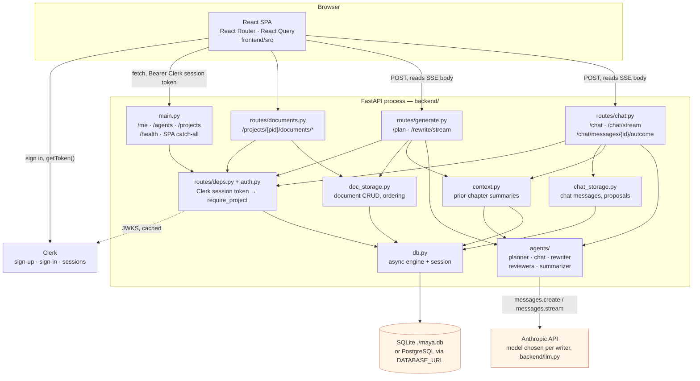
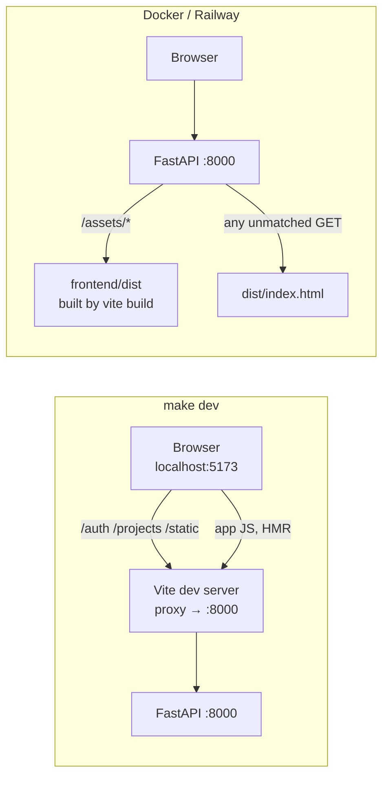

# System overview

Maya is one FastAPI process, one React single-page app, one SQL database, and two external services: the Anthropic API, and Clerk for accounts and sessions.
There is no queue, no cache server, and no background worker: every generation happens inside the HTTP request that asked for it.

## How to read it

**Every data route is project-scoped and authenticated.**
`require_project` (`backend/routes/deps.py`) resolves the Clerk session token to a `User` (created on that Clerk user's first request), loads the `Project`, and returns 404 — not 403 — when the caller does not own it, so a project id belonging to someone else is indistinguishable from one that never existed.

**Only the generation routes — `routes/generate.py` and `routes/chat.py` — talk to the agents.**
`routes/documents.py` is plain CRUD.
This is the seam worth keeping: document storage has no idea a model exists.

**The agents never touch the database.**
Each agent function takes a plain `state` dict and returns a plain dict; assembling that state from documents and persisting the result is the route's job.
That is why the agents are testable without a session.

## Dev versus production

The two setups differ only in who serves the JavaScript.

In dev, `:5173` is the URL you want — `frontend/vite.config.ts` proxies `/auth`, `/me`, `/agents`, `/projects`, and `/static` to the backend, and `:8000` serves the API but not the dev UI.
Set `BACKEND_PORT` to point the proxy somewhere other than `:8000`, which is how a second checkout runs alongside the first.

In production the SPA catch-all in `main.py` is registered last, so it only handles GET paths that no API route or static mount claimed.
That is what makes a hard reload on `/p/{id}/d/{id}` resolve to the app instead of a 404, while unknown API paths still 404 normally.
