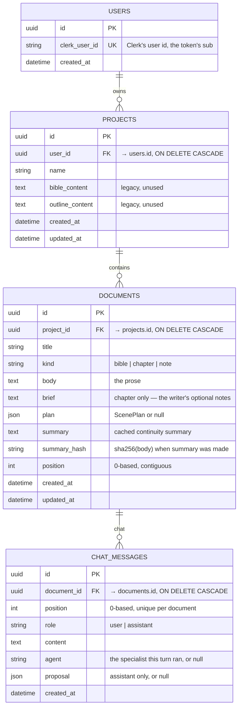
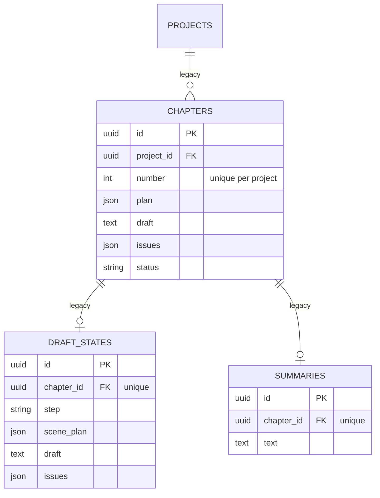
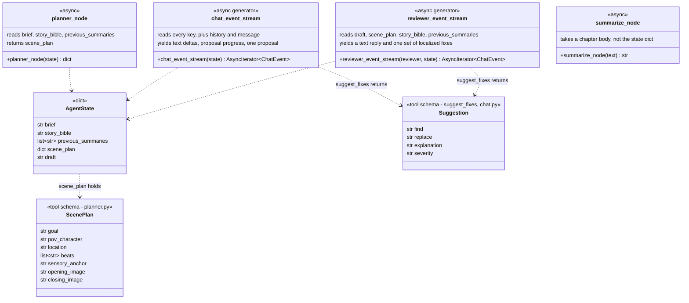

# Backend data model

Defined in `backend/db_models.py`; the schema itself is owned by Alembic (`alembic/versions/`), which is the only thing that writes DDL.

## The live tables

Three rules live in this table rather than in application code, and they are the ones worth knowing:

**One bible per project.**
`uq_documents_project_bible` is a *partial* unique index on `project_id` where `kind = 'bible'`.
Partial indexes work on both SQLite and PostgreSQL, so the same declaration covers local dev and the Railway deployment.
Creating a project seeds that bible document immediately (`main.py`), and `delete_document` refuses to remove it with a 409.

**`position` is contiguous.**
It is the sidebar order and the chapter order at once — `build_previous_summaries` uses "documents with a lower `position`" to mean "earlier chapters".
`delete_document` renumbers the survivors to close the gap, and `reorder_documents` rejects any list that is not exactly the project's document set.

**`summary_hash` is a cache key, not a checksum.**
It records the `sha256` of the body *at the time the summary was written*.
Any write to `body` sets it to `NULL`, invalidating the cached summary.
See [03](03-backend-workflows.md#summary-caching).

One more rule belongs to `chat_messages`: **the server never applies a proposal.**
`proposal` records what the assistant proposed and the `sha256` of the body it was computed against (`base_hash`), in one of two kinds.
A `write` carries `mode` and `text`, the whole body it would produce (`proposed_body`, cleared once resolved), and one `outcome` (`accepted`, `discarded`, `stale`, or null while under review).
A `suggestions` set carries a list of localized fixes — `find`, `replace`, a one-line `explanation`, an optional `severity`, the offsets into the base body, and **an `outcome` per fix**, so taking one leaves the rest awaiting review.
The editor applies a fix only while the span still reads as its `find`, and it refuses the set outright unless the chapter still hashes to `base_hash`.
`delete_document` removes a chapter's messages explicitly, because SQLite enforces the foreign key's cascade only under a pragma the app does not set.
See [03](03-backend-workflows.md#chapter-chat).

## The legacy tables

`db_models.py` also defines `Chapter`, `DraftState`, and `Summary`.
**Nothing in the running application reads or writes them.**
They predate the document-based workspace and survive only for `scripts/migrate_to_db.py`, a one-off importer from the old file-based layout.
`Project.chapters`, `Project.bible_content`, and `Project.outline_content` are dead for the same reason.

Everything a chapter used to hold now lives on a single `documents` row: `draft` became `body`, `scene_plan` became `plan`, and the separate `summaries` table became the `summary` / `summary_hash` columns.

## The agent state contract

The agent functions in `backend/agents/` share one plain-dict shape, assembled by `build_chapter_state` in `backend/context.py`.
It is not a class — this diagram describes the keys, not a type that exists in the code.

| Key | Where it comes from |
|---|---|
| `brief` | `document.brief` — the writer's chapter notes, shown as "Chapter notes"; may be empty |
| `story_bible` | the body of the project's one `bible` document |
| `previous_summaries` | earlier chapters, oldest first (see [03](03-backend-workflows.md#summary-caching)) |
| `scene_plan` | `document.plan`, or `{}` when there is none |
| `draft` | the chapter body: what a review pass reads and what the chat proposes changes to |
| `history` | chat only: the chapter's earlier messages, from `chat_storage.history` |
| `message` | chat only: the writer's new message |

`ScenePlan` and `Suggestion` are not Python classes either — they are JSON Schemas passed to the Anthropic API as tools, so the model returns structured data rather than prose to parse.
The planner's tool is forced (`tool_choice` pins it) and raises `RuntimeError` if the response carries no `tool_use` block.
The frontend mirrors both shapes as TypeScript interfaces in `frontend/src/api/types.ts`; those files must be changed together.

`chat_event_stream` picks between two tools: `write_draft` (replace or append) and `suggest_fixes` (a set of exact find/replace fixes, each with its reason).
A reviewer is offered `suggest_fixes` alone, and is *not* forced to call it — a chapter with nothing wrong must be able to come back as a sentence rather than an invented fix — with `severity` required on its copy of the schema.
`build_proposal` validates the call against the chapter and turns it into a proposal: each `find` must occur exactly once, fixes may not overlap, and a `replace` identical to its `find` is refused. Every problem in a set is reported at once, and a call that cannot become a proposal gets a single correction inside the turn.
