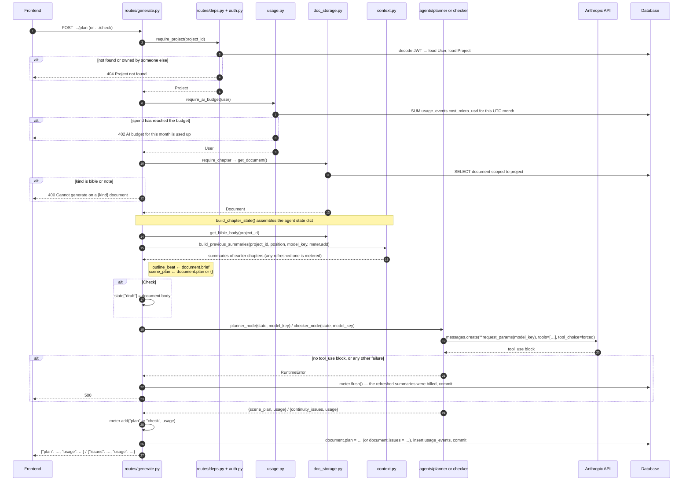
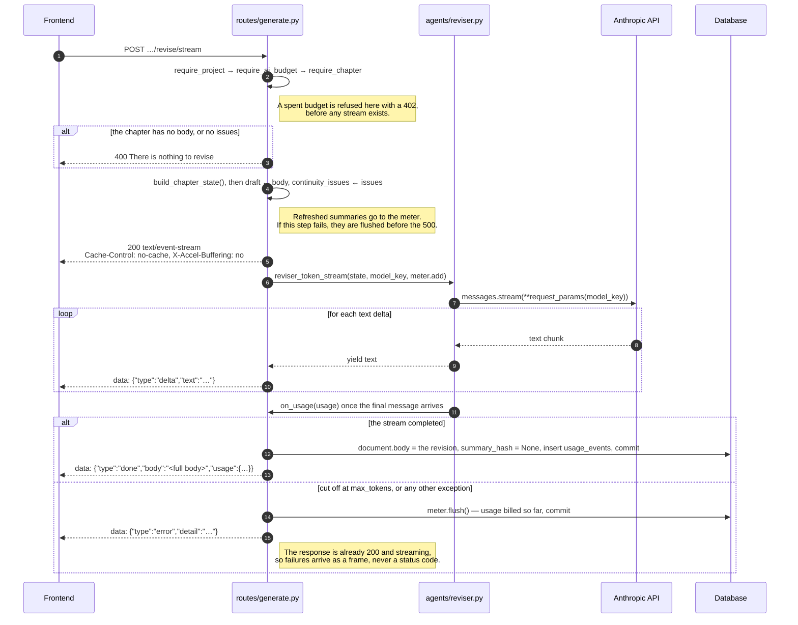
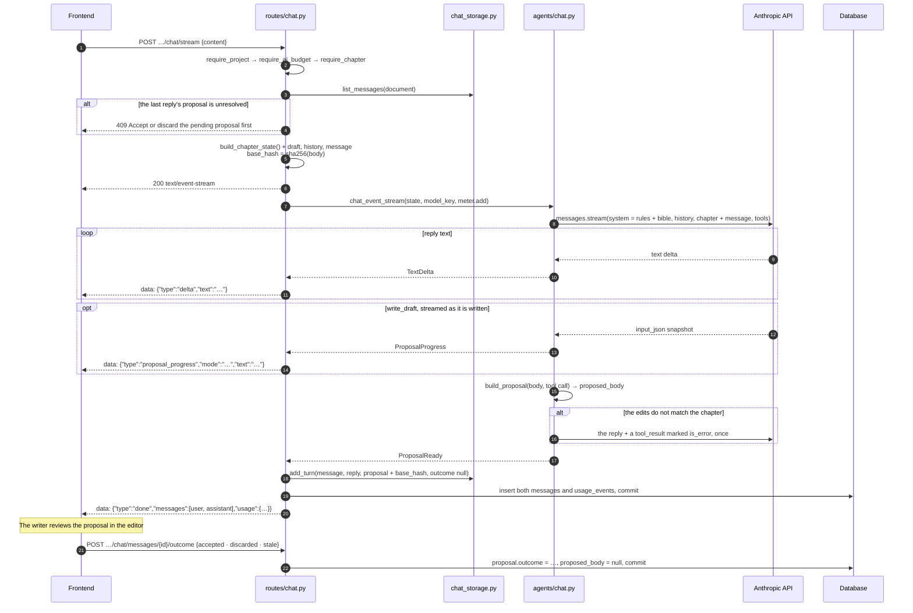
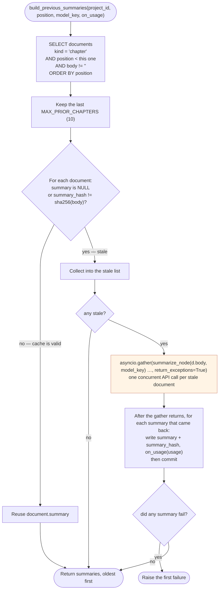
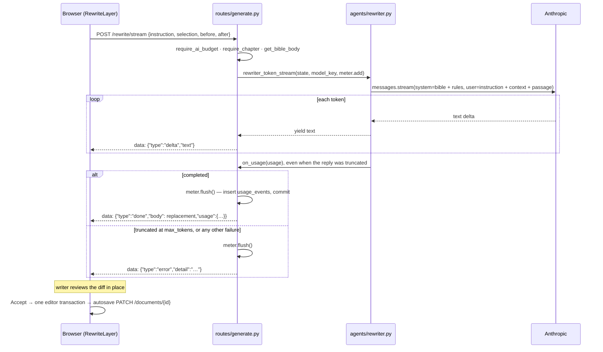

# Backend workflows

Every generation route lives in `backend/routes/generate.py` or `backend/routes/chat.py` under the prefix `/projects/{project_id}/documents/{document_id}`, and every one of them starts the same way: authenticate, resolve the project, refuse if the writer's AI budget is spent, insist the document is a chapter, then assemble agent state.

Every model call runs on the writer's chosen model (`user.model_key`) and reports its token usage to a `Meter` (`backend/usage.py`).
The meter holds that usage in memory and writes it as `usage_events` rows in the same commit that persists the route's own result.
On any failure after a billed call it still writes what was collected, so spend is never dropped with the error.

## Plan and Check

The two non-streaming routes.
They differ only in which agent they call and which column they write.

**The budget gate is the same on all five routes, and it is pre-flight only.**
It reads the ledger and reserves nothing, and a call's cost lands only when the call finishes.
So a request that starts under the cap always runs to completion, and a writer with several requests in flight at once can overshoot by one call per request.
Because the gate runs before any `StreamingResponse` exists, a blocked stream fails as a plain `402`, not as an error frame.

**The `usage` in every response is the writer's meter after this call**, so the editor updates its spend without polling.

**Planning is optional.**
Nothing calls the planner except `/plan`; a chapter without a plan is drafted in the chat from its brief and the writer's message.

Note what **Check** does *not* do: it reads `document.body` from the database, not from the request.
Whatever the writer has typed but not yet saved is invisible to it — which is why the frontend saves pending edits before calling this route (see [05](05-frontend-flows.md#saving-before-the-server-reads)).

## Revise — server-sent events

Revise rewrites the chapter to fix the issues Check reported, streaming the result.

**The error frame exists because the status code is already spent.**
Headers go out before the first token, so nothing after that point can be reported as a 4xx or 5xx.
The client must treat an `error` frame as a failed request.

**A truncated revision is an error, not a shorter chapter.**
Revise replaces the body wholesale, so a reply cut off at `max_tokens` would silently delete the end of the chapter.
`reviser_token_stream` raises `RevisionTruncatedError` instead, and the route writes the body only after the stream completes.

**`X-Accel-Buffering: no`** tells a reverse proxy not to buffer the response, which would otherwise hold the tokens back and deliver them in one lump at the end.

## Chapter chat

`routes/chat.py` is where drafting happens.
Each writer message is one turn: one model call (two when an edit needs correcting), streamed back as reply text plus at most one proposal.
The route never changes `document.body`; it stores the proposal, and the editor applies it if the writer accepts.

**A failed turn leaves the conversation as it was.**
Both messages are written in the same commit as the usage, and only once the reply is complete.
On an `error` frame nothing but the billed usage is stored, so the writer can simply send again.

**The next message waits for an outcome.**
While a proposal is unresolved the route answers 409.
The outcome is stated at the start of the following message, so the model is never asked anything while assuming a discarded change is in the text.

**History is rendered as text.**
Earlier turns go to the model as plain user and assistant messages, with a proposal described (a draft of N words, or its list of edits) rather than replayed as a tool call.
A writer can switch models mid-conversation, and no request depends on how an earlier model's thinking blocks must be replayed.
The rules and the bible come first and the chapter text last, so the stable prefix is cacheable; the model sees the most recent 40 messages.

**Edits are validated before the writer sees them.**
Every `find` must occur exactly once in the current body, and no two edits may overlap.
A call that fails gets one correction inside the turn; a second failure becomes an `error` frame.

## Summary caching

`build_previous_summaries` in `backend/context.py` is called by every generation route.
Without caching, drafting chapter 12 would summarize eleven chapters from scratch on every single click.

**Only the API calls run concurrently.** `AsyncSession` is not concurrency-safe, so every database write happens *after* `gather` returns, never inside the coroutines it is awaiting.
For the same reason usage is reported through `on_usage` (the route's `meter.add`), which only appends to a list; the meter writes it later, in one commit.

**A failed summary does not discard its siblings.**
Each summary that came back was a billed call, so it is stored and reported before the first failure is raised.

**The 10-chapter cap is a cost ceiling.**
Without it, the first generation on chapter 30 fires 29 model calls.
With it, the planner and checker see the ten most recent chapters — a deliberate trade of long-range continuity for a bounded bill.

**Empty documents are skipped entirely**, so an outlined-but-unwritten chapter in the middle of the book costs nothing and contributes nothing.

## Selection rewrite

`/rewrite/stream` is the one generation route that never writes to the document; the only thing it persists is its usage.
It also skips `build_chapter_state`, so it refreshes no summaries.
The client sends the selected span plus a window of prose on each side; the rewriter returns only the replacement; the client splices it in when the writer accepts, and the ordinary autosave persists it.

The model never sees the rest of the chapter and never emits it, so everything outside the selection is preserved by construction.
