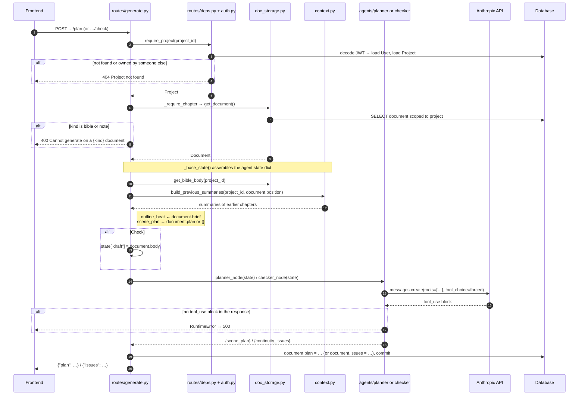
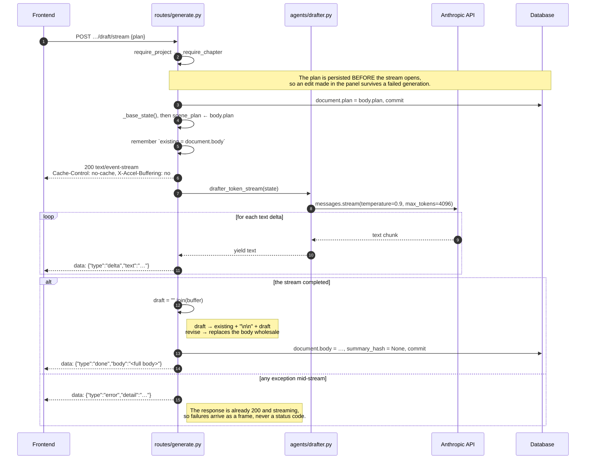
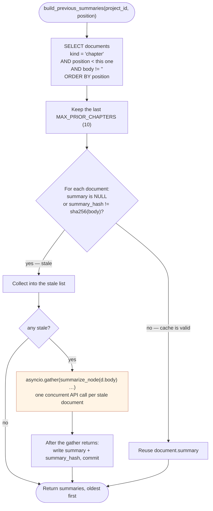
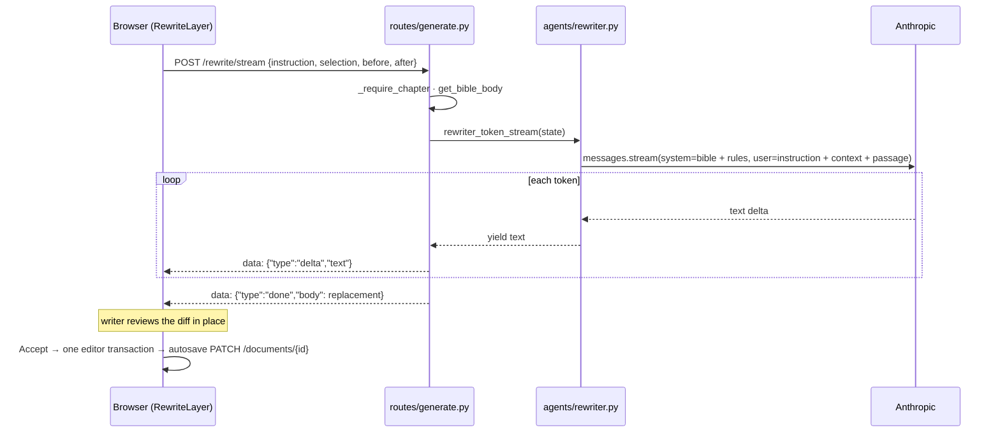

# Backend workflows

Every generation route lives in `backend/routes/generate.py` under the prefix `/projects/{project_id}/documents/{document_id}`, and every one of them starts the same way: authenticate, resolve the project, insist the document is a chapter, then assemble agent state.

## Plan and Check

The two non-streaming routes.
They differ only in which agent they call and which column they write.

Note what **Check** does *not* do: it reads `document.body` from the database, not from the request.
Whatever the writer has typed but not yet saved is invisible to it — which is why the frontend flushes its pending autosave before calling this route (see [05](05-frontend-flows.md#generating-a-draft)).

## Draft and Revise — server-sent events

Both streaming routes share the same skeleton and differ in two places: what seeds the state, and whether the finished prose is appended or replaces the body.

Three things this diagram is trying to make obvious:

**The error frame exists because the status code is already spent.**
Headers go out before the first token, so nothing after that point can be reported as a 4xx or 5xx.
The client must treat an `error` frame as a failed request.

**`X-Accel-Buffering: no`** tells a reverse proxy not to buffer the response, which would otherwise hold the tokens back and deliver them in one lump at the end.

**Draft appends, revise replaces.**
`/draft/stream` concatenates onto whatever body already exists — running it twice gives you two scenes.
`/revise/stream` overwrites, because it was given the current draft plus its issues and returned a corrected version of the same text.
Its state seeds `draft` from `document.body` and `continuity_issues` from `document.issues`, which is exactly the condition that makes `_build_messages` take its revision branch.

Both paths clear `summary_hash`, because the body just changed and any cached summary of it is now stale.

## Summary caching

`build_previous_summaries` in `backend/context.py` is called by every generation route.
Without caching, drafting chapter 12 would summarize eleven chapters from scratch on every single click.

**Only the API calls run concurrently.** `AsyncSession` is not concurrency-safe, so every database write happens *after* `gather` returns, never inside the coroutines it is awaiting.

**The 10-chapter cap is a cost ceiling.**
Without it, the first generation on chapter 30 fires 29 model calls.
With it, the planner and checker see the ten most recent chapters — a deliberate trade of long-range continuity for a bounded bill.

**Empty documents are skipped entirely**, so an outlined-but-unwritten chapter in the middle of the book costs nothing and contributes nothing.

## Selection rewrite

`/rewrite/stream` is the one generation route that writes nothing.
The client sends the selected span plus a window of prose on each side; the rewriter returns only the replacement; the client splices it in when the writer accepts, and the ordinary autosave persists it.

The model never sees the rest of the chapter and never emits it, so everything outside the selection is preserved by construction.
