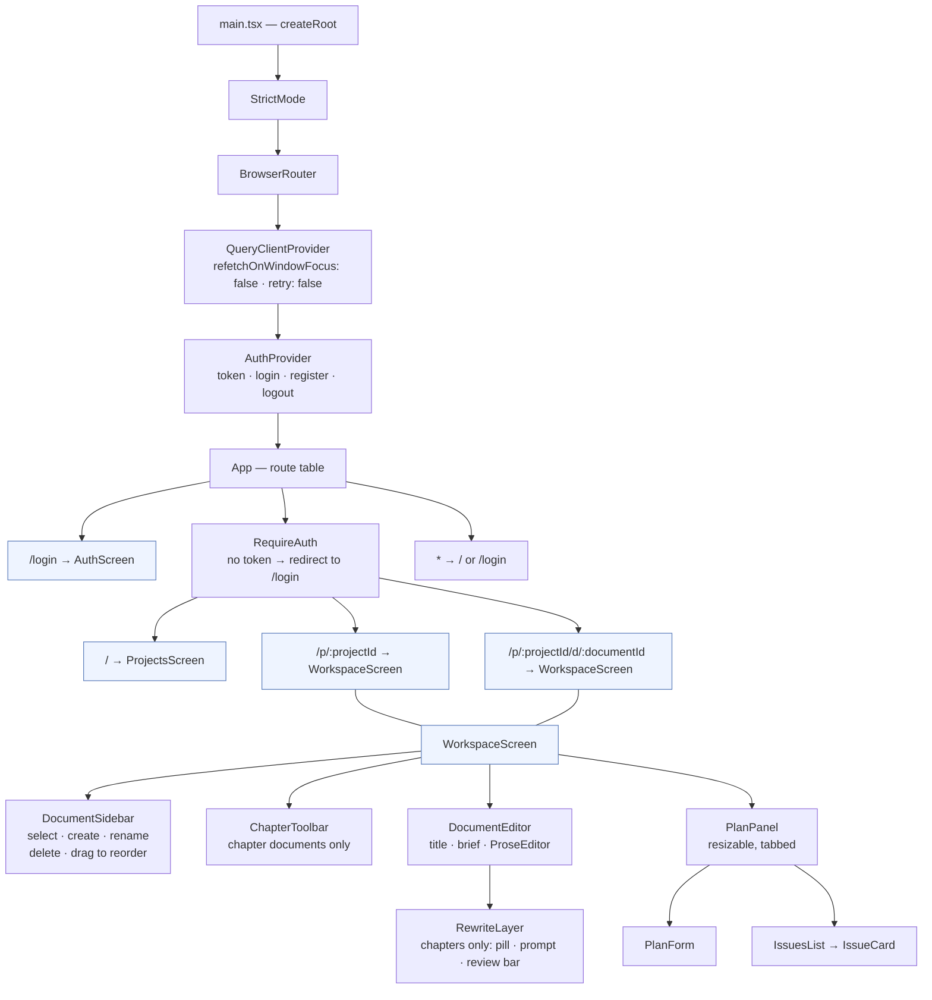
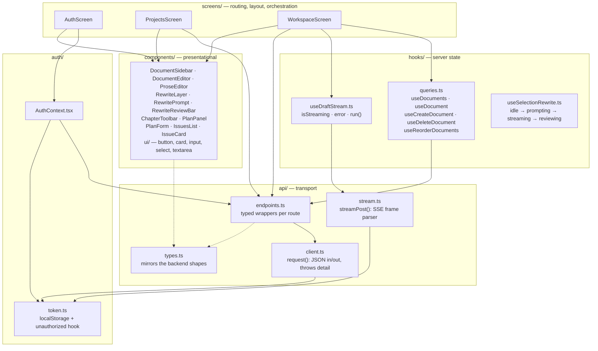
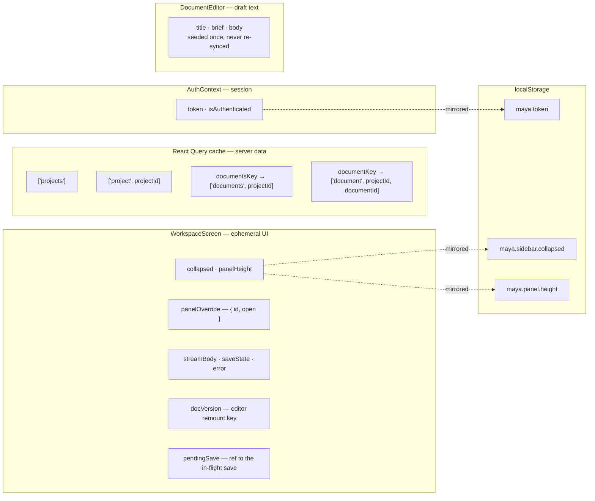

# Frontend architecture

React 19 + Vite, with React Router for navigation and TanStack Query for server state.
Source lives in `frontend/src/`.

## Provider and component tree

`AuthProvider` sits **inside** `BrowserRouter` on purpose: it calls `useNavigate` to redirect on logout, which is only legal beneath a router.

`ChapterToolbar` and `PlanPanel` render only when the open document has `kind === 'chapter'`.
Bible and note documents get the editor and nothing else — they have no plan, no issues, and no generation actions.

The body is a CodeMirror 6 view (`ProseEditor`), not a textarea, so the chapter rewrite flow can draw over the real document.
`editor/rewriteExtension.ts` holds the overlay as editor state and renders it as decorations; `RewriteLayer` drives it and only ever changes the document through the single Accept transaction, which is why an accepted rewrite autosaves and undoes like any other edit.

## Module layers

The dependency arrows only point downward: components never call `api/` directly, and `api/` knows nothing about React.
`client.ts` and `stream.ts` both attach the bearer token and both handle a 401 the same way — they are separate because `EventSource` cannot issue a POST, so the streaming routes read `response.body` and parse `data: {…}\n\n` frames by hand.

One deliberate exception: **saving is not a hook.**
`WorkspaceScreen` calls `updateDocument` directly rather than through a mutation, so it can hold the in-flight promise in a ref and await it before opening a stream.
See [05](05-frontend-flows.md#generating-a-draft).

## Who owns which state

Two conventions are worth internalizing:

**`patchCache` writes to the query cache, `save` writes to the server.**
Generation results (`plan`, `issues`) are pushed into the cache with `qc.setQueryData` and separately persisted — no refetch round-trip, so the panel updates the instant the response lands.

**The editor's local state is seeded from props once and never re-synced.**
An effect that copied props into state would fight the user's in-flight typing.
Instead, when the server authoritatively rewrites a document — a different document, or a finished generation — `WorkspaceScreen` remounts the editor by changing its `key` (`${doc.id}:${docVersion}`).
The `bodyOverride` prop is the one bypass: during a stream it displays the server's text directly without touching local state.
