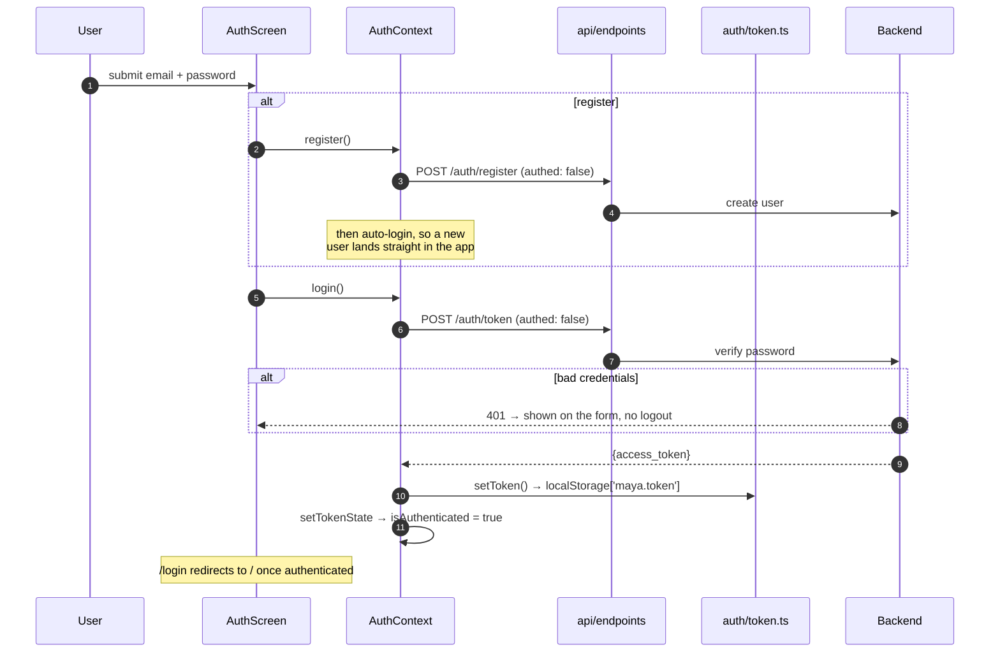
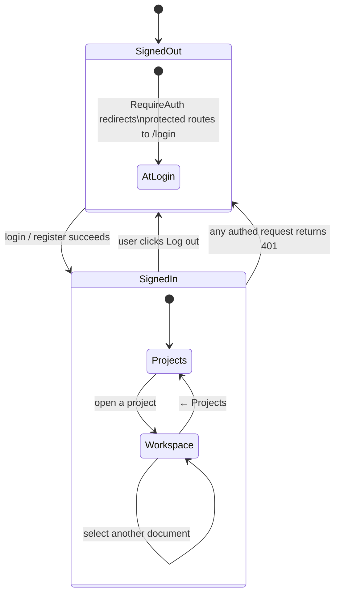
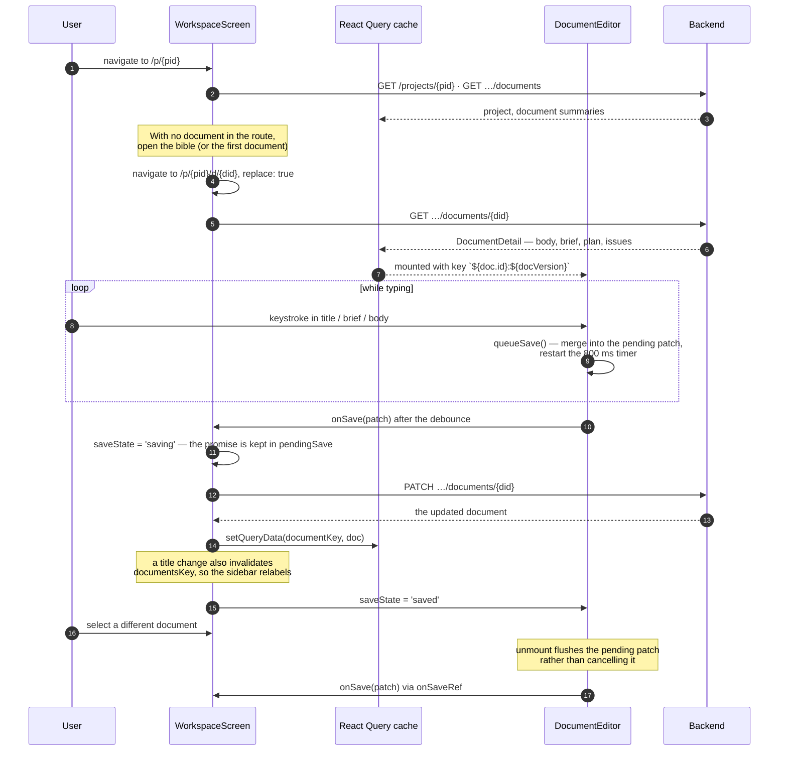
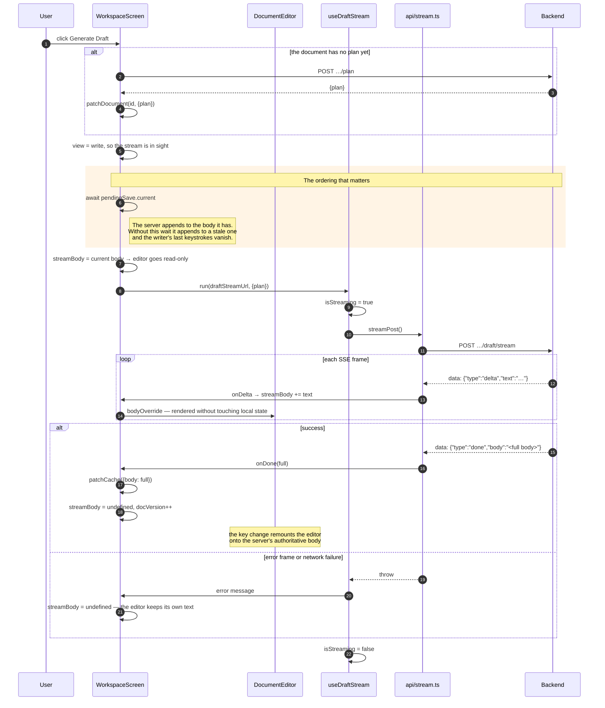
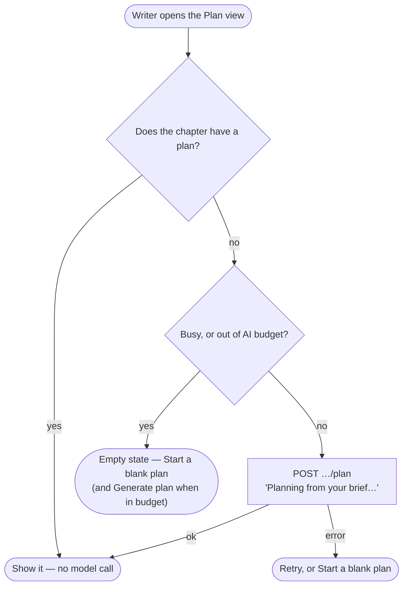

# Frontend flows

Three paths through the app, from the user's first click to the database.

## Auth and session expiry

The login and register calls pass `authed: false` for one reason: their 401 means "wrong password", not "session expired", and must surface on the form rather than triggering a logout.

Every other request goes through the shared 401 path:

The 401 path has an indirection worth understanding.
`api/client.ts` is not a React component, so it cannot navigate.
Instead it calls `handleUnauthorized()`, which clears the token and invokes whatever handler was registered — and `AuthProvider` registers one, in an effect, that drops the token from state and navigates to `/login`.
That is the whole job of `setUnauthorizedHandler` in `auth/token.ts`: it lets the transport layer log the app out without importing React.

## Opening and editing a document

Two details in `DocumentEditor` exist to prevent lost edits:

**Patches accumulate rather than replace.** Editing the title and then the body inside one 800 ms window must not drop the title, so `queueSave` merges into a pending object instead of overwriting it.

**Unmount flushes, it does not cancel.**
Switching documents unmounts the editor mid-debounce; without the flush, the last edits before the switch vanish.
`onSaveRef` is updated in an effect rather than during render precisely so that on unmount it still holds the *outgoing* document's save function — the patch lands on the right document.

## Generating a draft

The most intricate flow in the app, because the client and the server both want to write `body`.

**`pendingSave` is the point of the whole diagram.**
The server's draft route appends to `document.body` as it exists in the database.
If a debounced autosave is still in flight when the stream opens, the append lands on the previous version and the writer's last sentence is gone.
Holding the in-flight promise in a ref and awaiting it first is what makes that impossible — and it is why saving bypasses React Query's mutation machinery.
`Check` awaits the same promise for the same reason: it reads `document.body` server-side.

**The editor is read-only for the duration** (`readOnly={stream.isStreaming}`), so there is no window in which the user and the server are both appending.

**Revise takes the same path** with a `null` request body — the server already has the draft and the issues it needs — and its `done` frame replaces the body rather than extending it.

## Chapter views

A chapter fills its pane with one of three views, picked from the Write / Plan / Issues switcher in `ChapterToolbar`.
The choice is `chapterView` in `WorkspaceScreen`, and it resets to Write whenever the route's document changes.
The reset happens during render rather than in an effect, so the previous document's view never paints over the new one.

**The editor is hidden, not unmounted.**
It stays mounted behind the Plan and Issues views, so it keeps its undo history, scroll position, and selection.

**Regenerate offers Undo instead of a confirm dialog.**
The plan it replaces is kept in `undoState`, tagged with its document id, and Undo saves it back.
Editing the plan by hand, leaving the Plan view, or switching documents forgets it.

**Plan and Check pass the document id as the mutation variable.**
A result that lands after the writer has switched documents is written to the document it was asked for, not the one on screen.
A regenerate also awaits `pendingSave` first, so a plan edit still in flight cannot land after the new plan and restore the old one.

Generate Draft and Revise switch back to Write so the stream is in sight, and Check switches to Issues when its result arrives.
The switcher itself is never disabled: changing views calls no model, and a writer must be able to leave the Plan view while a plan generates.
