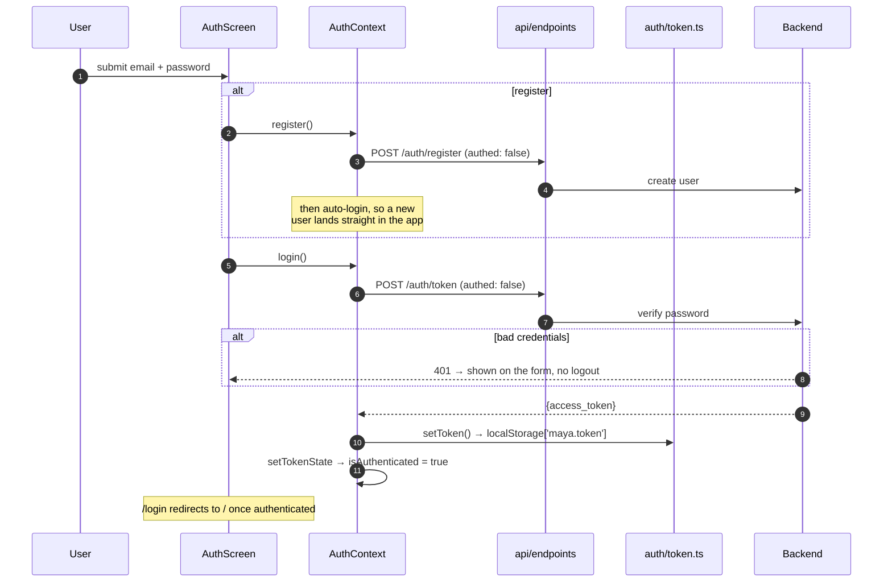
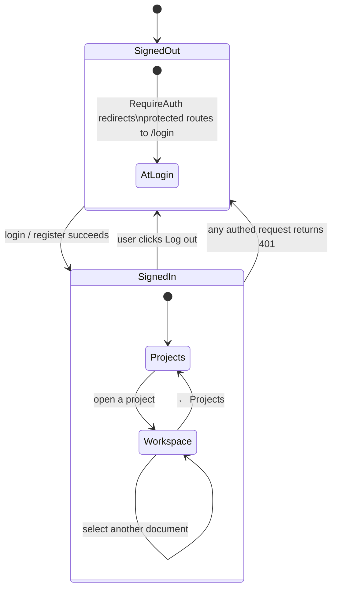
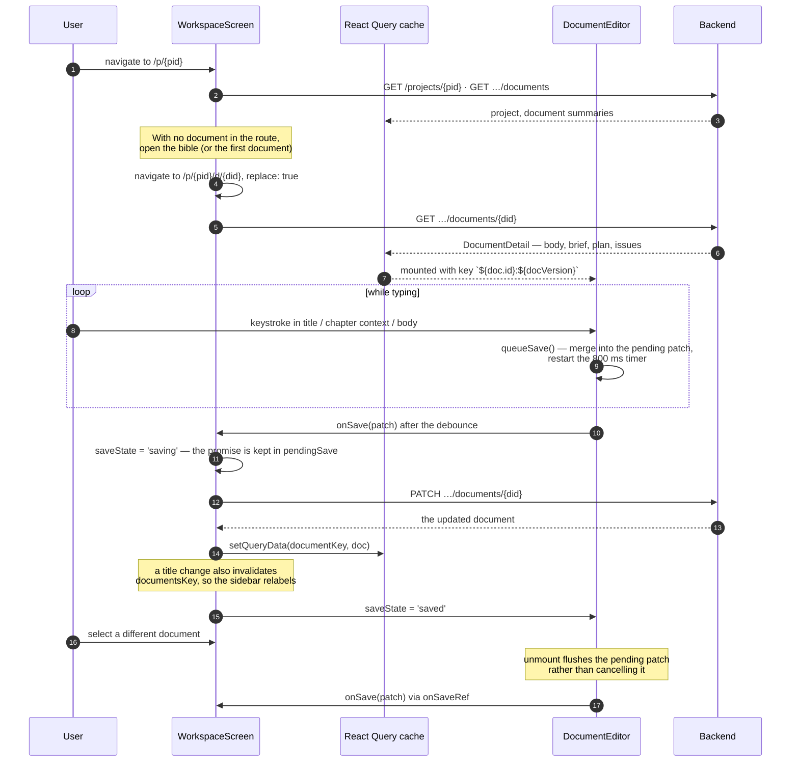
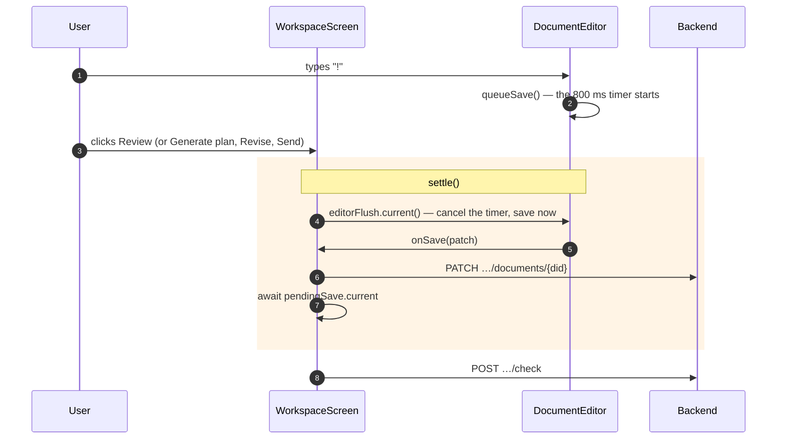
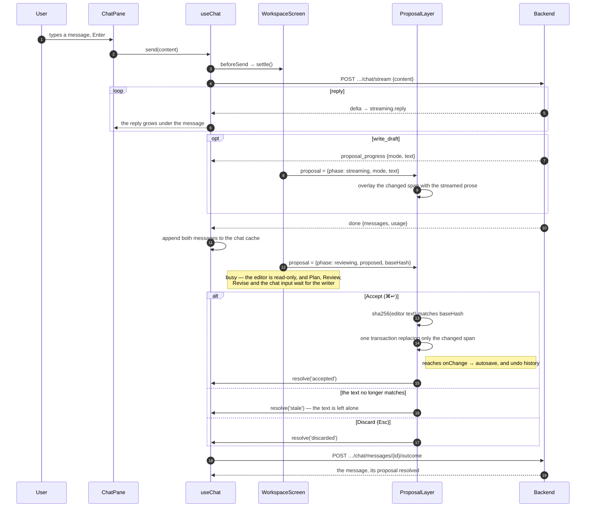
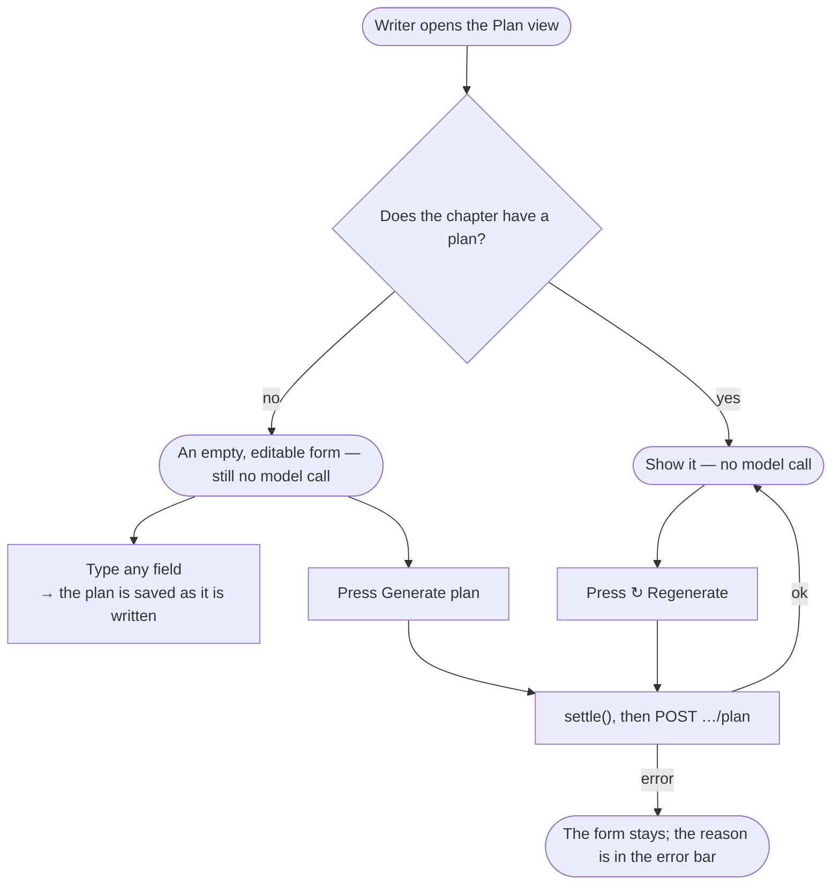

# Frontend flows

The main paths through the app, from the user's first click to the database.

## Auth and session expiry

The login and register calls pass `authed: false` for one reason: their 401 means "wrong password", not "session expired", and must surface on the form rather than triggering a logout.

Every other request goes through the shared 401 path:

The 401 path has an indirection worth understanding.
`api/client.ts` is not a React component, so it cannot navigate.
Instead it calls `handleUnauthorized()`, which clears the token and invokes whatever handler was registered — and `AuthProvider` registers one, in an effect, that drops the token from state and navigates to `/login`.
That is the whole job of `setUnauthorizedHandler` in `auth/token.ts`: it lets the transport layer log the app out without importing React.

## Opening and editing a document

Two details in `DocumentEditor` exist to prevent lost edits:

**Patches accumulate rather than replace.** Editing the title and then the body inside one 800 ms window must not drop the title, so `queueSave` merges into a pending object instead of overwriting it.

**Unmount flushes, it does not cancel.**
Switching documents unmounts the editor mid-debounce; without the flush, the last edits before the switch vanish.
`onSaveRef` is updated in an effect rather than during render precisely so that on unmount it still holds the *outgoing* document's save function — the patch lands on the right document.

## Saving before the server reads

Generate plan, Review, Revise, and the chat all read the chapter from the database, not from the request.
Whatever the writer has typed must be there first, and typed text can be in one of two places: still waiting out an 800 ms debounce, or in a save already on the wire.
There are two debounces, because two components own text: the editor's, for the title and body, and the workspace's own, for the chapter context the Write and Plan views share.

**`settle()` is the point of the diagram.**
Awaiting only `pendingSave` covers a save already in flight, but not an edit still inside the debounce window, which has not been sent at all.
The editor fills `editorFlush` with a function that cancels its timer and saves immediately; `settle()` calls it, flushes its own chapter-context timer, then awaits every save in flight.
A pending context edit carries the document it was typed in, so switching documents mid-debounce saves it to that chapter rather than dropping it.
This is also why saving bypasses React Query's mutation machinery: the workspace has to hold the in-flight promise.

**Revise streams into the editor.**
It sets `streamBody`, which the editor renders through `bodyOverride` without touching its own state, and keeps the editor read-only (`readOnly={stream.isStreaming}`) so the writer and the server never write at once.
On `done` it bumps `docVersion`, and the key change remounts the editor onto the server's body; an `error` frame leaves the editor's own text in place.

## A chat turn

Every AI change to a chapter's prose, apart from Revise and selection rewrite, arrives through the chat as a proposal.

**The proposal is drawn, not applied, until Accept.**
`ProposalLayer` finds the smallest span that differs between the editor's text and the proposed chapter (`changedSpan`) and hides that span behind a widget: the streamed prose while it arrives, then a word diff for edits or the clean text for a new draft.

**Accept checks the hash first.**
The server stored the `sha256` of the body the proposal was computed against.
If the editor's text hashes to anything else — the chapter was changed in another tab, say — the proposal is recorded as `stale` and nothing is applied.

**A new message waits for the outcome.**
While a proposal is unresolved the chat input is disabled with the reason shown, and the server would refuse the message with a 409 anyway.
A failed message is removed from the pane and its text goes back into the input.

**The Plan view's Draft from plan → is a chat message.**
It switches to the Write view, opens the chat, and sends "Draft this chapter from the scene plan."; the agent reads the saved plan along with the rest of the chapter's context.
Nothing plans on its own when drafting: a chapter without a plan is drafted from its chapter context, if any, and the writer's message.

**A proposal brings the Write view forward.**
It is reviewed in the editor, so when one starts streaming (or a saved one loads) while Plan or Issues is open, the view switches to Write.
It switches once, on arrival; the writer can still move to another view while the proposal waits.

## Chapter views

A chapter fills its main pane with one of three views, picked from the Write / Plan / Issues switcher in `ChapterToolbar`; the chat stays beside all three.
The choice is `chapterView` in `WorkspaceScreen`, and it resets to Write whenever the route's document changes.
The reset happens during render rather than in an effect, so the previous document's view never paints over the new one.

**Opening the Plan view calls no model.**
A chapter without a plan gets the empty form, to fill in by hand or to generate on request; nothing is spent until the writer asks.
Generating settles first, so context typed a moment earlier is what the planner reads.

**The chapter context is shared, not copied.**
`WorkspaceScreen` owns the text and its debounce, and the Write and Plan views each render `ChapterContext` against it, so an edit in one is already in the other.
The component keeps its own open/closed flag and broadcasts it, so both copies expand together.

**The editor is hidden, not unmounted.**
It stays mounted behind the Plan and Issues views, so it keeps its undo history, scroll position, and selection.

**Regenerate and Remove plan offer Undo instead of a confirm dialog.**
The plan they replace is kept in `undoState`, tagged with its document id, and Undo saves it back.
Removing matters because planning is optional: the chat, checker, and reviser are sent whatever plan is saved, so a stale or empty one would keep steering them.
Removal does not generate a replacement; only opening the Plan view on a chapter without a plan does.
Editing the plan by hand, leaving the Plan view, or switching documents forgets it.

**Plan and Review pass the document id as the mutation variable.**
A result that lands after the writer has switched documents is written to the document it was asked for, not the one on screen.

Revise switches back to Write so the stream is in sight, and Review switches to Issues when its result arrives.
The Issues tab is offered only once a review has run — `issues` is no longer null, even when it found nothing — so a chapter starts with just Write and Plan.
The switcher itself is never disabled: changing views calls no model, and a writer must be able to leave the Plan view while a plan generates.
