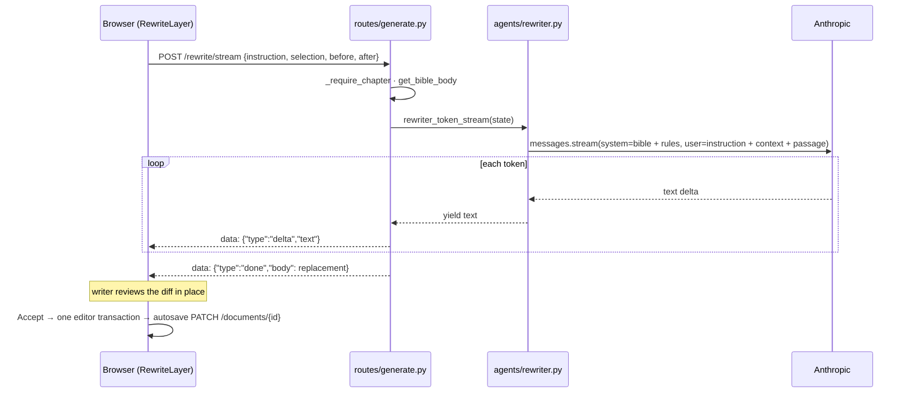

# Selection Rewrite Implementation Plan

> **For agentic workers:** REQUIRED SUB-SKILL: Use superpowers:subagent-driven-development (recommended) or superpowers:executing-plans to implement this plan task-by-task. Steps use checkbox (`- [ ]`) syntax for tracking.

**Goal:** Let a writer select a span of chapter prose, give a free-text instruction, watch the model's replacement stream into place, review it as an inline diff, and accept or discard it.

**Architecture:** A new `rewriter` agent and a non-persisting `rewrite/stream` SSE endpoint on the backend.
On the frontend the chapter textarea becomes a CodeMirror 6 editor (`ProseEditor`); a chapter-only extension renders the rewrite state as decorations over the real document, and a React layer (`RewriteLayer`) owns the state machine, the stream, and the floating prompt and review cards.
Accept dispatches a single editor change so the existing autosave and undo history pick it up.

**Tech Stack:** FastAPI, Anthropic SDK streaming, pytest; React 19, TypeScript, Tailwind 4, CodeMirror 6 (`@codemirror/state`, `@codemirror/view`, `@codemirror/commands`), jsdiff (`diff`), Vitest + Testing Library.

**Spec:** `docs/superpowers/specs/2026-09-05-selection-rewrite-design.md`

## Global Constraints

- Rewrite is available on chapter documents only; the endpoint returns 400 for bible and note documents.
- The endpoint persists nothing; `document.body` and `summary_hash` are untouched by a rewrite.
- The SSE frame format is unchanged: `{"type":"delta","text"}`, `{"type":"done","body"}`, `{"type":"error","detail"}`.
  For the rewrite endpoint `body` is the completed replacement span.
- Request limits: `instruction` 1–2000 chars, `selection` 1–20000 chars, `before` and `after` at most 4000 chars each.
- Context windows are trimmed client-side to 1500 chars before and 500 chars after the selection.
- Accept must reach the editor through a CodeMirror transaction so autosave and undo see it.
  Never set React state to the spliced text directly.
- The body stays a plain string with `\n` line breaks.
  No rich text.
- Frontend colours: accent violet `#7c3aed` on tint `#ede9fe`; removed words rose `#be123c` on `#ffe4e6`; added words green `#15803d` on `#dcfce7`.
- The frontend lint config enables the React Compiler hook rules as errors: no `ref.current` reads or writes during render, no synchronous `setState` in an effect body, and manual `useMemo`/`useCallback` deps must match what the function uses.
  Write refs and position DOM inside effects; keep handler closures fresh through a ref assigned in an effect.
- Run git through `/usr/bin/git` (a shell hook rewrites bare `git`).
- Commit messages carry no co-author trailer.
- Markdown files put each sentence on its own line.
- Every task ends with `cd frontend && npm run typecheck && npm run lint && npm test` (frontend tasks) or `uv run pytest` (backend tasks) passing.

---

## File map

Backend:

- Create `backend/agents/rewriter.py` — prompt builder and token stream for a span rewrite.
- Modify `backend/routes/generate.py` — `RewriteBody` model and `POST .../rewrite/stream`.
- Create `tests/test_rewriter.py`; modify `tests/test_generate_api.py`.

Frontend:

- Modify `frontend/package.json` — CodeMirror and `diff` dependencies.
- Modify `frontend/src/api/stream.ts` — optional `AbortSignal`.
- Modify `frontend/src/api/endpoints.ts` — `rewriteStreamUrl`.
- Create `frontend/src/lib/rewrite.ts` — pure text helpers.
- Create `frontend/src/hooks/useSelectionRewrite.ts` — reducer and stream orchestration.
- Create `frontend/src/editor/rewriteExtension.ts` — CodeMirror state field, decorations, widget, keymap, theme.
- Create `frontend/src/components/ProseEditor.tsx` — CodeMirror wrapper.
- Create `frontend/src/test/editor.ts` — test helpers for driving a CodeMirror view.
- Create `frontend/src/components/RewritePrompt.tsx`, `RewriteReviewBar.tsx`, `RewriteLayer.tsx` — floating UI and orchestration.
- Modify `frontend/src/components/DocumentEditor.tsx` — swap the textarea for `ProseEditor`, mount `RewriteLayer` on chapters.
- Modify `frontend/src/screens/WorkspaceScreen.tsx` — pass `projectId`, fold rewrite busy into `busy`.
- Modify `docs/diagrams/01-system-overview.md`, `03-backend-workflows.md`, `04-frontend-architecture.md`, `README.md`.

---

### Task 1: Rewriter agent

**Files:**
- Create: `backend/agents/rewriter.py`
- Test: `tests/test_rewriter.py`

**Interfaces:**
- Produces: `_build_rewrite_messages(state: dict) -> tuple[str, str]` and `rewriter_token_stream(state: dict) -> AsyncIterator[str]`.
  `state` carries string keys `story_bible`, `instruction`, `selection`, `before`, `after`.

- [ ] **Step 1: Write the failing tests**

```python
# tests/test_rewriter.py
from contextlib import asynccontextmanager
from unittest.mock import MagicMock, patch

import pytest

from backend.agents.rewriter import _build_rewrite_messages, rewriter_token_stream


def _state(sample_bible, **over):
    state = {
        "story_bible": sample_bible,
        "instruction": "make this more tense",
        "selection": "She waited by the door.",
        "before": "The hall was empty. ",
        "after": " A clock ticked somewhere.",
    }
    state.update(over)
    return state


def test_system_prompt_carries_the_story_bible(sample_bible):
    system, _ = _build_rewrite_messages(_state(sample_bible))
    assert "STORY BIBLE:" in system
    assert "adverbs ending in -ly" in system


def test_system_prompt_restricts_output_to_the_replacement(sample_bible):
    system, _ = _build_rewrite_messages(_state(sample_bible))
    assert "ONLY" in system
    assert "No commentary" in system


def test_user_content_carries_instruction_selection_and_context(sample_bible):
    _, user = _build_rewrite_messages(_state(sample_bible))
    assert "INSTRUCTION:\nmake this more tense" in user
    assert "PASSAGE TO REWRITE:\nShe waited by the door." in user
    assert "CONTEXT BEFORE (do not rewrite):\nThe hall was empty. " in user
    assert "CONTEXT AFTER (do not rewrite):\n A clock ticked somewhere." in user


@pytest.mark.asyncio
async def test_token_stream_yields_text_deltas(sample_bible):
    async def fake_text_stream():
        for t in ["She ", "froze."]:
            yield t

    stream = MagicMock()
    stream.text_stream = fake_text_stream()

    @asynccontextmanager
    async def fake_stream(**kwargs):
        yield stream

    with patch("backend.agents.rewriter.client.messages.stream", new=fake_stream):
        out = [t async for t in rewriter_token_stream(_state(sample_bible))]
    assert out == ["She ", "froze."]
```

- [ ] **Step 2: Run the tests to verify they fail**

Run: `uv run pytest tests/test_rewriter.py -v`
Expected: FAIL with `ModuleNotFoundError: No module named 'backend.agents.rewriter'`

- [ ] **Step 3: Write the agent**

```python
# backend/agents/rewriter.py
from collections.abc import AsyncIterator

import anthropic
from backend.settings import get_model

client = anthropic.AsyncAnthropic()


def _build_rewrite_messages(state: dict) -> tuple[str, str]:
    """Build (system_prompt, user_content) for a span rewrite.

    The model sees only the selected passage plus read-only context and must
    return only the replacement. The surrounding text is spliced back in
    client-side, so everything outside the selection is preserved by
    construction rather than by trusting the model.
    """
    bible = state["story_bible"]

    system_prompt = (
        "You are rewriting a passage of literary fiction.\n"
        "Follow the voice and prose rules given in the story bible below.\n\n"
        f"STORY BIBLE:\n{bible}\n\n"
        "Rewrite ONLY the passage marked PASSAGE TO REWRITE, following the instruction.\n"
        "The context before and after is shown for continuity only: do not rewrite or repeat it.\n"
        "Write only the replacement prose. No commentary, no meta-text, no titles."
    )
    user_content = (
        f"INSTRUCTION:\n{state['instruction']}\n\n"
        f"CONTEXT BEFORE (do not rewrite):\n{state['before']}\n\n"
        f"PASSAGE TO REWRITE:\n{state['selection']}\n\n"
        f"CONTEXT AFTER (do not rewrite):\n{state['after']}"
    )
    return system_prompt, user_content


async def rewriter_token_stream(state: dict) -> AsyncIterator[str]:
    """Yield replacement text deltas as the model writes them. Owns the API
    call only; SSE framing is the endpoint's responsibility."""
    system_prompt, user_content = _build_rewrite_messages(state)

    async with client.messages.stream(
        model=get_model(),
        max_tokens=4096,
        temperature=0.9,
        system=system_prompt,
        messages=[{"role": "user", "content": user_content}],
    ) as stream:
        async for text in stream.text_stream:
            yield text
```

- [ ] **Step 4: Run the tests to verify they pass**

Run: `uv run pytest tests/test_rewriter.py -v`
Expected: 4 passed

- [ ] **Step 5: Commit**

```bash
/usr/bin/git add backend/agents/rewriter.py tests/test_rewriter.py
/usr/bin/git commit -m "feat: add rewriter agent for selection rewrites"
```

---

### Task 2: Rewrite stream endpoint

**Files:**
- Modify: `backend/routes/generate.py`
- Test: `tests/test_generate_api.py`

**Interfaces:**
- Consumes: `rewriter_token_stream(state)` from Task 1.
- Produces: `POST /projects/{project_id}/documents/{document_id}/rewrite/stream` with JSON body `{instruction, selection, before, after}`, streaming SSE frames.

- [ ] **Step 1: Write the failing tests**

Append to `tests/test_generate_api.py`:

```python
@pytest.mark.asyncio
async def test_rewrite_stream_returns_the_replacement_without_persisting(chapter):
    client, project_id, doc_id = chapter
    await client.patch(
        f"/projects/{project_id}/documents/{doc_id}",
        json={"body": "The hall was empty. She waited by the door. A clock ticked."},
    )

    async def fake_stream(state):
        for text in ["She ", "froze."]:
            yield text

    with patch("backend.routes.generate.rewriter_token_stream", new=fake_stream):
        resp = await client.post(
            f"/projects/{project_id}/documents/{doc_id}/rewrite/stream",
            json={
                "instruction": "more tense",
                "selection": "She waited by the door.",
                "before": "The hall was empty. ",
                "after": " A clock ticked.",
            },
        )
    frames = _parse_sse(resp.text)
    assert [f["text"] for f in frames if f["type"] == "delta"] == ["She ", "froze."]
    assert next(f for f in frames if f["type"] == "done")["body"] == "She froze."

    doc = (await client.get(f"/projects/{project_id}/documents/{doc_id}")).json()
    assert doc["body"] == "The hall was empty. She waited by the door. A clock ticked."


@pytest.mark.asyncio
async def test_rewrite_stream_passes_the_bible_and_the_request_fields(chapter):
    client, project_id, doc_id = chapter
    bible_id = (await client.get(f"/projects/{project_id}/documents")).json()[0]["id"]
    await client.patch(
        f"/projects/{project_id}/documents/{bible_id}", json={"body": "## Style\n\nVoice: terse"}
    )
    seen = {}

    async def fake_stream(state):
        seen.update(state)
        yield "x"

    with patch("backend.routes.generate.rewriter_token_stream", new=fake_stream):
        await client.post(
            f"/projects/{project_id}/documents/{doc_id}/rewrite/stream",
            json={"instruction": "tighten", "selection": "Some prose."},
        )
    assert "Voice: terse" in seen["story_bible"]
    assert seen["instruction"] == "tighten"
    assert seen["selection"] == "Some prose."
    assert seen["before"] == ""
    assert seen["after"] == ""


@pytest.mark.asyncio
async def test_rewrite_stream_emits_an_error_frame(chapter):
    client, project_id, doc_id = chapter

    async def boom(state):
        raise RuntimeError("model exploded")
        yield  # pragma: no cover — makes this an async generator

    with patch("backend.routes.generate.rewriter_token_stream", new=boom):
        resp = await client.post(
            f"/projects/{project_id}/documents/{doc_id}/rewrite/stream",
            json={"instruction": "tighten", "selection": "Some prose."},
        )
    error = next(f for f in _parse_sse(resp.text) if f["type"] == "error")
    assert "model exploded" in error["detail"]


@pytest.mark.asyncio
async def test_rewrite_stream_on_a_note_returns_400(authed_client):
    client, project_id = authed_client
    note = (
        await client.post(f"/projects/{project_id}/documents", json={"kind": "note"})
    ).json()["id"]
    resp = await client.post(
        f"/projects/{project_id}/documents/{note}/rewrite/stream",
        json={"instruction": "tighten", "selection": "Some prose."},
    )
    assert resp.status_code == 400


@pytest.mark.asyncio
@pytest.mark.parametrize(
    "body",
    [
        {"instruction": "", "selection": "Some prose."},
        {"instruction": "tighten", "selection": ""},
        {"instruction": "tighten"},
    ],
)
async def test_rewrite_stream_rejects_empty_input(chapter, body):
    client, project_id, doc_id = chapter
    resp = await client.post(
        f"/projects/{project_id}/documents/{doc_id}/rewrite/stream", json=body
    )
    assert resp.status_code == 422
```

- [ ] **Step 2: Run the tests to verify they fail**

Run: `uv run pytest tests/test_generate_api.py -k rewrite -v`
Expected: FAIL. The first three fail with `AttributeError: ... has no attribute 'rewriter_token_stream'`; the 400 and 422 tests fail with status 404 (route missing).

- [ ] **Step 3: Add the request model and endpoint**

In `backend/routes/generate.py`, change the imports:

```python
from fastapi import APIRouter, Depends, HTTPException
from fastapi.responses import StreamingResponse
from pydantic import BaseModel, Field
from sqlalchemy.ext.asyncio import AsyncSession

from backend.agents.checker import checker_node
from backend.agents.drafter import drafter_token_stream
from backend.agents.planner import planner_node
from backend.agents.rewriter import rewriter_token_stream
```

Below `PlanBody`, add:

```python
class RewriteBody(BaseModel):
    instruction: str = Field(min_length=1, max_length=2000)
    selection: str = Field(min_length=1, max_length=20000)
    before: str = Field(default="", max_length=4000)
    after: str = Field(default="", max_length=4000)
```

At the end of the file, add:

```python
@router.post("/rewrite/stream")
async def rewrite_stream(
    document_id: uuid.UUID,
    body: RewriteBody,
    project: Project = Depends(require_project),
    db: AsyncSession = Depends(get_db),
):
    """Stream a replacement for one selected span. Persists nothing: the
    client splices the replacement in only when the writer accepts it, and
    the normal autosave carries it to the server."""
    document = await _require_chapter(db, project.id, document_id)
    state = {
        "story_bible": await get_bible_body(db, document.project_id),
        "instruction": body.instruction,
        "selection": body.selection,
        "before": body.before,
        "after": body.after,
    }

    async def gen():
        buf = []
        try:
            async for text in rewriter_token_stream(state):
                buf.append(text)
                yield _sse({"type": "delta", "text": text})
            yield _sse({"type": "done", "body": "".join(buf)})
        except Exception as e:
            yield _sse({"type": "error", "detail": str(e)})

    return StreamingResponse(gen(), media_type="text/event-stream", headers=_SSE_HEADERS)
```

- [ ] **Step 4: Run the whole backend suite**

Run: `uv run pytest`
Expected: all passed, including the seven new rewrite tests.

- [ ] **Step 5: Commit**

```bash
/usr/bin/git add backend/routes/generate.py tests/test_generate_api.py
/usr/bin/git commit -m "feat: add non-persisting rewrite/stream endpoint"
```

---

### Task 3: Frontend plumbing — dependencies, abortable stream, endpoint URL, pure helpers

**Files:**
- Modify: `frontend/package.json`
- Modify: `frontend/src/api/stream.ts`, `frontend/src/api/stream.test.ts`
- Modify: `frontend/src/api/endpoints.ts`
- Create: `frontend/src/lib/rewrite.ts`, `frontend/src/lib/rewrite.test.ts`

**Interfaces:**
- Produces: `streamPost(url, body, callbacks, signal?: AbortSignal): Promise<void>` that resolves silently when aborted.
- Produces: `rewriteStreamUrl(projectId: string, documentId: string): string`.
- Produces from `lib/rewrite.ts`:
  - `interface TextRange { from: number; to: number }`
  - `spliceText(text: string, range: TextRange, replacement: string): string`
  - `contextWindows(text: string, range: TextRange, beforeMax = 1500, afterMax = 500): { before: string; selection: string; after: string }`
  - `matchEdgeWhitespace(original: string, replacement: string): string`
  - `interface DiffPart { value: string; added: boolean; removed: boolean }` and `wordDiff(oldText: string, newText: string): DiffPart[]`

- [ ] **Step 1: Install the dependencies**

```bash
cd frontend && npm install @codemirror/state@^6.7.4 @codemirror/view@^6.43.11 @codemirror/commands@^6.11.0 diff@^9.0.0
```

Expected: `package.json` gains the four entries under `dependencies`; `package-lock.json` updates. `diff` v9 ships its own TypeScript types, so no `@types/diff`.

- [ ] **Step 2: Write the failing tests for the helpers**

```ts
// frontend/src/lib/rewrite.test.ts
import { describe, expect, it } from 'vitest';
import { contextWindows, matchEdgeWhitespace, spliceText, wordDiff } from './rewrite';

describe('spliceText', () => {
  it('replaces only the range and keeps everything else byte-for-byte', () => {
    const text = 'The hall was empty. She waited by the door. A clock ticked.';
    const out = spliceText(text, { from: 20, to: 43 }, 'She froze.');
    expect(out).toBe('The hall was empty. She froze. A clock ticked.');
  });
});

describe('contextWindows', () => {
  it('splits text around the range', () => {
    const text = 'aaa SELECTED zzz';
    expect(contextWindows(text, { from: 4, to: 12 })).toEqual({
      before: 'aaa ',
      selection: 'SELECTED',
      after: ' zzz',
    });
  });

  it('bounds the windows', () => {
    const text = 'x'.repeat(2000) + 'SEL' + 'y'.repeat(2000);
    const w = contextWindows(text, { from: 2000, to: 2003 });
    expect(w.before).toHaveLength(1500);
    expect(w.after).toHaveLength(500);
    expect(w.selection).toBe('SEL');
  });
});

describe('matchEdgeWhitespace', () => {
  it('copies the original leading and trailing whitespace onto a trimmed reply', () => {
    expect(matchEdgeWhitespace('\n\nOld text.\n', '  New text.\n\n')).toBe('\n\nNew text.\n');
  });

  it('leaves a reply alone when the original has no edge whitespace', () => {
    expect(matchEdgeWhitespace('Old.', 'New.')).toBe('New.');
  });

  it('does not double whitespace when the original is only whitespace', () => {
    expect(matchEdgeWhitespace('  ', 'New.')).toBe('  New.');
  });
});

describe('wordDiff', () => {
  it('marks removed and added words', () => {
    const parts = wordDiff('She waited by the door.', 'She froze by the door.');
    expect(parts.find((p) => p.removed)?.value).toBe('waited');
    expect(parts.find((p) => p.added)?.value).toBe('froze');
    expect(parts.every((p) => typeof p.added === 'boolean' && typeof p.removed === 'boolean')).toBe(true);
  });
});
```

Add to `frontend/src/api/stream.test.ts`, inside the `describe('streamPost', ...)` block:

```ts
  it('resolves silently when the request is aborted before it starts', async () => {
    const controller = new AbortController();
    controller.abort();
    vi.spyOn(globalThis, 'fetch').mockRejectedValue(
      Object.assign(new Error('The operation was aborted.'), { name: 'AbortError' }),
    );
    await expect(
      streamPost('/x', {}, { onDelta: () => {}, onDone: () => {} }, controller.signal),
    ).resolves.toBeUndefined();
  });

  it('stops reading and resolves when aborted mid-stream', async () => {
    const controller = new AbortController();
    const encoder = new TextEncoder();
    // A body that delivers one delta, then stays open forever.
    const body = new ReadableStream<Uint8Array>({
      start(c) {
        c.enqueue(encoder.encode('data: {"type":"delta","text":"one"}\n\n'));
      },
    });
    vi.spyOn(globalThis, 'fetch').mockResolvedValue(new Response(body, { status: 200 }));

    const deltas: string[] = [];
    const run = streamPost(
      '/x',
      {},
      {
        onDelta: (t) => {
          deltas.push(t);
          controller.abort();
        },
        onDone: () => {},
      },
      controller.signal,
    );
    await expect(run).resolves.toBeUndefined();
    expect(deltas).toEqual(['one']);
  });
```

- [ ] **Step 3: Run the tests to verify they fail**

Run: `cd frontend && npx vitest run src/lib/rewrite.test.ts src/api/stream.test.ts`
Expected: `rewrite.test.ts` fails to import `./rewrite`; the mid-stream abort test hangs or fails (no signal support yet).

- [ ] **Step 4: Implement the helpers**

```ts
// frontend/src/lib/rewrite.ts
// Pure helpers for selection rewrite. No React, no network, no CodeMirror.
import { diffWords } from 'diff';

export interface TextRange {
  from: number;
  to: number;
}

/** Replace [from, to) with `replacement`; every other character is untouched. */
export function spliceText(text: string, { from, to }: TextRange, replacement: string): string {
  return text.slice(0, from) + replacement + text.slice(to);
}

/** Split text around the range, trimming the context to the given maxima. */
export function contextWindows(
  text: string,
  { from, to }: TextRange,
  beforeMax = 1500,
  afterMax = 500,
): { before: string; selection: string; after: string } {
  return {
    before: text.slice(Math.max(0, from - beforeMax), from),
    selection: text.slice(from, to),
    after: text.slice(to, to + afterMax),
  };
}

/**
 * Trim the model's reply, then give it the original selection's leading and
 * trailing whitespace, so a selection that ended in a paragraph break still
 * ends in one after the rewrite.
 */
export function matchEdgeWhitespace(original: string, replacement: string): string {
  const lead = /^\s*/.exec(original)![0];
  const trail = /\s*$/.exec(original.slice(lead.length))![0];
  return lead + replacement.trim() + trail;
}

export interface DiffPart {
  value: string;
  added: boolean;
  removed: boolean;
}

/** Word-level diff of old → new, for inline review rendering. */
export function wordDiff(oldText: string, newText: string): DiffPart[] {
  return diffWords(oldText, newText).map((p) => ({
    value: p.value,
    added: Boolean(p.added),
    removed: Boolean(p.removed),
  }));
}
```

- [ ] **Step 5: Add abort support to `streamPost`**

Replace the body of `frontend/src/api/stream.ts` from `export async function streamPost` to the end with:

```ts
export async function streamPost(
  url: string,
  body: unknown,
  { onDelta, onDone }: StreamCallbacks,
  signal?: AbortSignal,
): Promise<void> {
  let res: Response;
  try {
    res = await fetch(url, {
      method: 'POST',
      headers: { 'Content-Type': 'application/json', ...authHeaders() },
      body: body ? JSON.stringify(body) : null,
      signal,
    });
  } catch (e) {
    if (signal?.aborted) return; // the caller gave up; not an error
    throw e;
  }
  if (res.status === 401) {
    handleUnauthorized();
    throw new Error('Your session has expired. Please sign in again.');
  }
  if (!res.ok) {
    const err = (await res.json().catch(() => ({}))) as { detail?: string };
    throw new Error(err.detail || res.statusText);
  }
  if (!res.body) {
    throw new Error('Streaming not supported by this response');
  }

  const reader = res.body.getReader();
  const decoder = new TextDecoder();
  let buf = '';

  try {
    for (;;) {
      if (signal?.aborted) {
        await reader.cancel();
        return;
      }
      const { value, done } = await reader.read();
      if (done) break;
      buf += decoder.decode(value, { stream: true });

      let sep: number;
      while ((sep = buf.indexOf('\n\n')) >= 0) {
        const raw = buf.slice(0, sep).replace(/^data: /, '');
        buf = buf.slice(sep + 2);
        if (!raw) continue;
        const evt = JSON.parse(raw) as Frame;
        if (evt.type === 'delta') onDelta(evt.text);
        else if (evt.type === 'done') onDone(evt.body);
        else if (evt.type === 'error') throw new Error(evt.detail);
        if (signal?.aborted) {
          await reader.cancel();
          return;
        }
      }
    }
  } catch (e) {
    if (signal?.aborted) return;
    throw e;
  }
}
```

Also update the `StreamCallbacks.onDone` doc comment to: `/** The completed text of the stream: the document's new body for draft/revise, the replacement span for rewrite. */`

- [ ] **Step 6: Add the endpoint URL**

In `frontend/src/api/endpoints.ts`, after `reviseStreamUrl`, add:

```ts
export const rewriteStreamUrl = (projectId: string, documentId: string) =>
  `/projects/${projectId}/documents/${documentId}/rewrite/stream`;
```

And change the file's header comment line `the streaming routes (draft/revise)` to `the streaming routes (draft/revise/rewrite)`.

- [ ] **Step 7: Run the tests to verify they pass**

Run: `cd frontend && npx vitest run src/lib/rewrite.test.ts src/api/stream.test.ts`
Expected: all passed.

- [ ] **Step 8: Typecheck, lint, full test run**

Run: `cd frontend && npm run typecheck && npm run lint && npm test`
Expected: clean.

- [ ] **Step 9: Commit**

```bash
/usr/bin/git add frontend/package.json frontend/package-lock.json frontend/src/api/stream.ts frontend/src/api/stream.test.ts frontend/src/api/endpoints.ts frontend/src/lib/rewrite.ts frontend/src/lib/rewrite.test.ts
/usr/bin/git commit -m "feat: rewrite helpers, abortable streamPost, and rewrite stream URL"
```

---

### Task 4: `useSelectionRewrite` reducer and hook

**Files:**
- Create: `frontend/src/hooks/useSelectionRewrite.ts`
- Test: `frontend/src/hooks/useSelectionRewrite.test.ts`

**Interfaces:**
- Consumes: `streamPost`, `rewriteStreamUrl`, `matchEdgeWhitespace`, `TextRange` from Task 3.
- Produces:

```ts
export type RewritePhase = 'idle' | 'prompting' | 'streaming' | 'reviewing';
export interface RewriteState {
  phase: RewritePhase;
  range: TextRange | null;
  original: string;      // the selected text at open time
  instruction: string;
  replacement: string;
  error: string | null;
}
export type RewriteAction =
  | { type: 'open'; range: TextRange; original: string }
  | { type: 'submit'; instruction: string }
  | { type: 'delta'; text: string }
  | { type: 'done'; text: string }
  | { type: 'error'; message: string }
  | { type: 'retry' }
  | { type: 'cancel' };
export const initialRewriteState: RewriteState;
export function rewriteReducer(state: RewriteState, action: RewriteAction): RewriteState;
export interface RewriteContext { selection: string; before: string; after: string }
export function useSelectionRewrite(args: { projectId: string; documentId: string }): {
  state: RewriteState;
  open: (range: TextRange, original: string) => void;
  submit: (instruction: string, context: RewriteContext) => Promise<void>;
  retry: () => void;
  cancel: () => void;
};
```

- [ ] **Step 1: Write the failing tests**

```ts
// frontend/src/hooks/useSelectionRewrite.test.ts
import { describe, expect, it, vi } from 'vitest';
import { act, renderHook } from '@testing-library/react';
import {
  initialRewriteState,
  rewriteReducer,
  useSelectionRewrite,
  type RewriteState,
} from './useSelectionRewrite';
import * as streamApi from '../api/stream';

const RANGE = { from: 4, to: 12 };

function at(phase: RewriteState['phase'], extra: Partial<RewriteState> = {}): RewriteState {
  return { ...initialRewriteState, phase, range: RANGE, original: 'Old text', ...extra };
}

describe('rewriteReducer', () => {
  it('open moves idle to prompting with the range and original text', () => {
    const s = rewriteReducer(initialRewriteState, { type: 'open', range: RANGE, original: 'Old text' });
    expect(s).toEqual(at('prompting'));
  });

  it('submit moves prompting to streaming and keeps the instruction', () => {
    const s = rewriteReducer(at('prompting'), { type: 'submit', instruction: 'tighten' });
    expect(s.phase).toBe('streaming');
    expect(s.instruction).toBe('tighten');
    expect(s.replacement).toBe('');
    expect(s.error).toBeNull();
  });

  it('delta appends while streaming and is ignored otherwise', () => {
    const streaming = rewriteReducer(at('streaming'), { type: 'delta', text: 'New ' });
    expect(rewriteReducer(streaming, { type: 'delta', text: 'text' }).replacement).toBe('New text');
    expect(rewriteReducer(at('reviewing'), { type: 'delta', text: 'x' })).toEqual(at('reviewing'));
  });

  it('done moves to reviewing with the edge whitespace matched to the original', () => {
    const s = rewriteReducer(at('streaming', { original: 'Old text\n' }), { type: 'done', text: ' New text ' });
    expect(s.phase).toBe('reviewing');
    expect(s.replacement).toBe('New text\n');
    expect(s.error).toBeNull();
  });

  it('done with an empty reply becomes an error', () => {
    const s = rewriteReducer(at('streaming'), { type: 'done', text: '  \n' });
    expect(s.phase).toBe('reviewing');
    expect(s.error).toMatch(/empty/i);
    expect(s.replacement).toBe('');
  });

  it('error moves streaming to reviewing with the message', () => {
    const s = rewriteReducer(at('streaming', { replacement: 'partial' }), { type: 'error', message: 'boom' });
    expect(s).toEqual(at('reviewing', { error: 'boom', replacement: '' }));
  });

  it('retry returns to prompting and keeps the instruction', () => {
    const s = rewriteReducer(at('reviewing', { instruction: 'tighten', replacement: 'x', error: 'boom' }), {
      type: 'retry',
    });
    expect(s).toEqual(at('prompting', { instruction: 'tighten' }));
  });

  it('cancel resets to idle from any phase', () => {
    for (const phase of ['prompting', 'streaming', 'reviewing'] as const) {
      expect(rewriteReducer(at(phase), { type: 'cancel' })).toEqual(initialRewriteState);
    }
  });
});

describe('useSelectionRewrite', () => {
  it('streams deltas into the replacement and lands in reviewing', async () => {
    vi.spyOn(streamApi, 'streamPost').mockImplementation(async (_url, _body, cb) => {
      cb.onDelta('New ');
      cb.onDelta('text');
      cb.onDone('New text');
    });
    const { result } = renderHook(() => useSelectionRewrite({ projectId: 'p', documentId: 'd' }));

    act(() => result.current.open(RANGE, 'Old text'));
    await act(() => result.current.submit('tighten', { selection: 'Old text', before: '', after: '' }));

    expect(result.current.state.phase).toBe('reviewing');
    expect(result.current.state.replacement).toBe('New text');
    expect(streamApi.streamPost).toHaveBeenCalledWith(
      '/projects/p/documents/d/rewrite/stream',
      { instruction: 'tighten', selection: 'Old text', before: '', after: '' },
      expect.anything(),
      expect.any(AbortSignal),
    );
  });

  it('surfaces a stream failure as an error', async () => {
    vi.spyOn(streamApi, 'streamPost').mockRejectedValue(new Error('boom'));
    const { result } = renderHook(() => useSelectionRewrite({ projectId: 'p', documentId: 'd' }));

    act(() => result.current.open(RANGE, 'Old text'));
    await act(() => result.current.submit('tighten', { selection: 'Old text', before: '', after: '' }));

    expect(result.current.state.phase).toBe('reviewing');
    expect(result.current.state.error).toBe('boom');
  });

  it('cancel aborts the in-flight request and returns to idle', async () => {
    let seenSignal: AbortSignal | undefined;
    vi.spyOn(streamApi, 'streamPost').mockImplementation(
      (_url, _body, _cb, signal) =>
        new Promise<void>((resolve) => {
          seenSignal = signal;
          signal!.addEventListener('abort', () => resolve());
        }),
    );
    const { result } = renderHook(() => useSelectionRewrite({ projectId: 'p', documentId: 'd' }));

    act(() => result.current.open(RANGE, 'Old text'));
    let pending: Promise<void>;
    act(() => {
      pending = result.current.submit('tighten', { selection: 'Old text', before: '', after: '' });
    });
    expect(result.current.state.phase).toBe('streaming');

    act(() => result.current.cancel());
    await act(() => pending!);

    expect(seenSignal?.aborted).toBe(true);
    expect(result.current.state).toEqual(initialRewriteState);
  });

  it('aborts on unmount', () => {
    let seenSignal: AbortSignal | undefined;
    vi.spyOn(streamApi, 'streamPost').mockImplementation(
      (_url, _body, _cb, signal) =>
        new Promise<void>(() => {
          seenSignal = signal;
        }),
    );
    const { result, unmount } = renderHook(() =>
      useSelectionRewrite({ projectId: 'p', documentId: 'd' }),
    );
    act(() => result.current.open(RANGE, 'Old text'));
    act(() => {
      void result.current.submit('tighten', { selection: 'Old text', before: '', after: '' });
    });
    unmount();
    expect(seenSignal?.aborted).toBe(true);
  });
});
```

- [ ] **Step 2: Run the tests to verify they fail**

Run: `cd frontend && npx vitest run src/hooks/useSelectionRewrite.test.ts`
Expected: FAIL, cannot resolve `./useSelectionRewrite`.

- [ ] **Step 3: Implement the reducer and hook**

```ts
// frontend/src/hooks/useSelectionRewrite.ts
// State machine and stream orchestration for selection rewrite. The pure
// reducer is exported for tests; the hook drives the SSE request and owns
// the AbortController so discard and unmount can cancel it.
import { useCallback, useEffect, useReducer, useRef } from 'react';
import { rewriteStreamUrl } from '../api/endpoints';
import { streamPost } from '../api/stream';
import { matchEdgeWhitespace, type TextRange } from '../lib/rewrite';

export type RewritePhase = 'idle' | 'prompting' | 'streaming' | 'reviewing';

export interface RewriteState {
  phase: RewritePhase;
  range: TextRange | null;
  /** The selected text at open time; the whitespace template for the reply. */
  original: string;
  instruction: string;
  replacement: string;
  error: string | null;
}

export const initialRewriteState: RewriteState = {
  phase: 'idle',
  range: null,
  original: '',
  instruction: '',
  replacement: '',
  error: null,
};

export type RewriteAction =
  | { type: 'open'; range: TextRange; original: string }
  | { type: 'submit'; instruction: string }
  | { type: 'delta'; text: string }
  | { type: 'done'; text: string }
  | { type: 'error'; message: string }
  | { type: 'retry' }
  | { type: 'cancel' };

export function rewriteReducer(state: RewriteState, action: RewriteAction): RewriteState {
  switch (action.type) {
    case 'open':
      return { ...initialRewriteState, phase: 'prompting', range: action.range, original: action.original };
    case 'submit':
      return { ...state, phase: 'streaming', instruction: action.instruction, replacement: '', error: null };
    case 'delta':
      if (state.phase !== 'streaming') return state;
      return { ...state, replacement: state.replacement + action.text };
    case 'done': {
      if (state.phase !== 'streaming') return state;
      if (!action.text.trim()) {
        return { ...state, phase: 'reviewing', replacement: '', error: 'The model returned an empty rewrite.' };
      }
      return {
        ...state,
        phase: 'reviewing',
        replacement: matchEdgeWhitespace(state.original, action.text),
        error: null,
      };
    }
    case 'error':
      if (state.phase !== 'streaming') return state;
      return { ...state, phase: 'reviewing', replacement: '', error: action.message };
    case 'retry':
      return { ...state, phase: 'prompting', replacement: '', error: null };
    case 'cancel':
      return initialRewriteState;
  }
}

export interface RewriteContext {
  selection: string;
  before: string;
  after: string;
}

export function useSelectionRewrite({
  projectId,
  documentId,
}: {
  projectId: string;
  documentId: string;
}) {
  const [state, dispatch] = useReducer(rewriteReducer, initialRewriteState);
  const abortRef = useRef<AbortController | null>(null);

  const open = useCallback(
    (range: TextRange, original: string) => dispatch({ type: 'open', range, original }),
    [],
  );
  const retry = useCallback(() => dispatch({ type: 'retry' }), []);
  const cancel = useCallback(() => {
    abortRef.current?.abort();
    dispatch({ type: 'cancel' });
  }, []);

  const submit = useCallback(
    async (instruction: string, context: RewriteContext) => {
      abortRef.current?.abort();
      const controller = new AbortController();
      abortRef.current = controller;
      dispatch({ type: 'submit', instruction });
      try {
        await streamPost(
          rewriteStreamUrl(projectId, documentId),
          { instruction, ...context },
          {
            onDelta: (text) => dispatch({ type: 'delta', text }),
            onDone: (text) => dispatch({ type: 'done', text }),
          },
          controller.signal,
        );
      } catch (e) {
        if (!controller.signal.aborted) dispatch({ type: 'error', message: (e as Error).message });
      }
    },
    [projectId, documentId],
  );

  // A rewrite must not outlive its editor: switching documents or a finished
  // generation remounts the editor, and the request goes with it.
  useEffect(() => () => abortRef.current?.abort(), []);

  return { state, open, submit, retry, cancel };
}
```

- [ ] **Step 4: Run the tests to verify they pass**

Run: `cd frontend && npx vitest run src/hooks/useSelectionRewrite.test.ts`
Expected: all passed.

- [ ] **Step 5: Typecheck, lint, commit**

Run: `cd frontend && npm run typecheck && npm run lint`

```bash
/usr/bin/git add frontend/src/hooks/useSelectionRewrite.ts frontend/src/hooks/useSelectionRewrite.test.ts
/usr/bin/git commit -m "feat: add useSelectionRewrite state machine"
```

---

### Task 5: `ProseEditor` — CodeMirror wrapper, and the editor test helper

**Files:**
- Create: `frontend/src/components/ProseEditor.tsx`
- Create: `frontend/src/test/editor.ts`
- Test: `frontend/src/components/ProseEditor.test.tsx`

**Interfaces:**
- Produces:

```ts
export interface ProseEditorProps {
  value: string;
  onChange: (text: string) => void;
  readOnly: boolean;
  ariaLabel: string;
  placeholder?: string;
  /** Extra CodeMirror extensions. Captured when the view is created; later changes are ignored. */
  extensions?: Extension[];
  /** Called once, after the view exists, so a sibling can drive it. */
  onViewReady?: (view: EditorView) => void;
  /** Rendered inside the editor's relative wrapper, above the text. */
  children?: ReactNode;
}
export function ProseEditor(props: ProseEditorProps): JSX.Element;
```

- Produces from `test/editor.ts`: `viewFor(label: string): EditorView` (finds the CodeMirror view behind the element with that aria-label) and `typeAtEnd(label: string, text: string): void` (dispatches an insert at the end of the document, inside `act`).

- [ ] **Step 1: Write the test helper**

```ts
// frontend/src/test/editor.ts
// Drive a CodeMirror view in tests. jsdom cannot deliver real keystrokes
// through CodeMirror's DOM observer, so edits go through view.dispatch, which
// is the same path a keystroke takes once CodeMirror has interpreted it.
import { act, screen } from '@testing-library/react';
import { EditorView } from '@codemirror/view';

export function viewFor(label: string): EditorView {
  const view = EditorView.findFromDOM(screen.getByLabelText(label) as HTMLElement);
  if (!view) throw new Error(`No CodeMirror view behind "${label}"`);
  return view;
}

export function typeAtEnd(label: string, text: string): void {
  const view = viewFor(label);
  act(() => {
    view.dispatch({
      changes: { from: view.state.doc.length, insert: text },
      userEvent: 'input.type',
    });
  });
}

export function selectRange(label: string, from: number, to: number): void {
  const view = viewFor(label);
  act(() => {
    view.dispatch({ selection: { anchor: from, head: to } });
  });
}
```

- [ ] **Step 2: Write the failing tests**

```tsx
// frontend/src/components/ProseEditor.test.tsx
import { describe, expect, it, vi } from 'vitest';
import { render, screen } from '@testing-library/react';
import { ProseEditor } from './ProseEditor';
import { typeAtEnd, viewFor } from '../test/editor';

describe('ProseEditor', () => {
  it('renders the value as editable text with the aria label', () => {
    render(<ProseEditor value="The rain." onChange={vi.fn()} readOnly={false} ariaLabel="Body" />);
    const el = screen.getByLabelText('Body');
    expect(el).toHaveTextContent('The rain.');
    expect(el).toHaveAttribute('contenteditable', 'true');
  });

  it('calls onChange with the full text on a user edit', () => {
    const onChange = vi.fn();
    render(<ProseEditor value="The rain." onChange={onChange} readOnly={false} ariaLabel="Body" />);
    typeAtEnd('Body', '!');
    expect(onChange).toHaveBeenCalledWith('The rain.!');
  });

  it('follows an external value change without reporting it as an edit', () => {
    const onChange = vi.fn();
    const { rerender } = render(
      <ProseEditor value="The rain." onChange={onChange} readOnly={false} ariaLabel="Body" />,
    );
    rerender(<ProseEditor value="The rain. More." onChange={onChange} readOnly={false} ariaLabel="Body" />);
    expect(viewFor('Body').state.doc.toString()).toBe('The rain. More.');
    expect(onChange).not.toHaveBeenCalled();
  });

  it('honours readOnly and can flip it without losing the document', () => {
    const { rerender } = render(
      <ProseEditor value="The rain." onChange={vi.fn()} readOnly ariaLabel="Body" />,
    );
    expect(screen.getByLabelText('Body')).toHaveAttribute('contenteditable', 'false');
    rerender(<ProseEditor value="The rain." onChange={vi.fn()} readOnly={false} ariaLabel="Body" />);
    expect(screen.getByLabelText('Body')).toHaveAttribute('contenteditable', 'true');
    expect(screen.getByLabelText('Body')).toHaveTextContent('The rain.');
  });

  it('hands the view to onViewReady once', () => {
    const onViewReady = vi.fn();
    const { rerender } = render(
      <ProseEditor value="x" onChange={vi.fn()} readOnly={false} ariaLabel="Body" onViewReady={onViewReady} />,
    );
    rerender(
      <ProseEditor value="y" onChange={vi.fn()} readOnly={false} ariaLabel="Body" onViewReady={onViewReady} />,
    );
    expect(onViewReady).toHaveBeenCalledTimes(1);
    expect(onViewReady.mock.calls[0][0]).toBe(viewFor('Body'));
  });
});
```

- [ ] **Step 3: Run the tests to verify they fail**

Run: `cd frontend && npx vitest run src/components/ProseEditor.test.tsx`
Expected: FAIL, cannot resolve `./ProseEditor`.

- [ ] **Step 4: Implement `ProseEditor`**

```tsx
// frontend/src/components/ProseEditor.tsx
// A CodeMirror 6 view dressed as a page of prose. Plain text in, plain text
// out: the document stays a string with newlines, which is what the backend
// agents read. Extensions (like the chapter rewrite overlay) are injected by
// the parent; this component knows nothing about them.
import { useEffect, useRef, type ReactNode } from 'react';
import { Annotation, Compartment, EditorState, type Extension } from '@codemirror/state';
import { EditorView, keymap, placeholder as cmPlaceholder } from '@codemirror/view';
import { defaultKeymap, history, historyKeymap } from '@codemirror/commands';
import { cn } from '../lib/utils';

export interface ProseEditorProps {
  value: string;
  onChange: (text: string) => void;
  readOnly: boolean;
  ariaLabel: string;
  placeholder?: string;
  /** Extra CodeMirror extensions. Captured when the view is created; later changes are ignored. */
  extensions?: Extension[];
  /** Called once, after the view exists, so a sibling can drive it. */
  onViewReady?: (view: EditorView) => void;
  /** Rendered inside the editor's relative wrapper, above the text. */
  children?: ReactNode;
}

/** Marks transactions that mirror the `value` prop, so they don't echo back through onChange. */
const external = Annotation.define<boolean>();

const proseTheme = EditorView.theme({
  '&': { height: '100%', fontSize: '15px', backgroundColor: 'transparent', color: '#1f2937' },
  '.cm-scroller': {
    fontFamily: 'ui-serif, Georgia, Cambria, "Times New Roman", Times, serif',
    lineHeight: '1.8',
    padding: '24px 0',
  },
  '.cm-content': { padding: '0 24px', caretColor: '#1f2937' },
  '.cm-line': { padding: '0' },
  '&.cm-focused': { outline: 'none' },
  '.cm-placeholder': { color: '#9ca3af', fontStyle: 'italic' },
});

const readOnlyConfig = (readOnly: boolean): Extension => [
  EditorView.editable.of(!readOnly),
  EditorState.readOnly.of(readOnly),
];

export function ProseEditor({
  value,
  onChange,
  readOnly,
  ariaLabel,
  placeholder,
  extensions = [],
  onViewReady,
  children,
}: ProseEditorProps) {
  const host = useRef<HTMLDivElement>(null);
  const viewRef = useRef<EditorView | null>(null);
  const readOnlyComp = useRef(new Compartment());
  const onChangeRef = useRef(onChange);
  useEffect(() => {
    onChangeRef.current = onChange;
  });

  // Create the view once. Props that can change later (value, readOnly) are
  // synced by the effects below; everything else is fixed for the view's life.
  useEffect(() => {
    const view = new EditorView({
      state: EditorState.create({
        doc: value,
        extensions: [
          history(),
          keymap.of([...defaultKeymap, ...historyKeymap]),
          EditorView.lineWrapping,
          proseTheme,
          EditorView.contentAttributes.of({
            'aria-label': ariaLabel,
            spellcheck: 'true',
            autocorrect: 'on',
          }),
          placeholder ? cmPlaceholder(placeholder) : [],
          readOnlyComp.current.of(readOnlyConfig(readOnly)),
          EditorView.updateListener.of((u) => {
            if (!u.docChanged) return;
            if (u.transactions.some((t) => t.annotation(external))) return;
            onChangeRef.current(u.state.doc.toString());
          }),
          ...extensions,
        ],
      }),
      parent: host.current!,
    });
    viewRef.current = view;
    onViewReady?.(view);
    return () => {
      view.destroy();
      viewRef.current = null;
    };
    // eslint-disable-next-line react-hooks/exhaustive-deps -- mount-only by design
  }, []);

  useEffect(() => {
    const view = viewRef.current;
    if (!view) return;
    const current = view.state.doc.toString();
    if (value === current) return;
    view.dispatch({
      changes: { from: 0, to: current.length, insert: value },
      annotations: external.of(true),
    });
  }, [value]);

  useEffect(() => {
    viewRef.current?.dispatch({
      effects: readOnlyComp.current.reconfigure(readOnlyConfig(readOnly)),
    });
  }, [readOnly]);

  return (
    <div className={cn('relative flex-1 min-h-0', readOnly ? 'bg-gray-50' : 'bg-white')}>
      <div ref={host} className="h-full" />
      {children}
    </div>
  );
}
```

- [ ] **Step 5: Run the tests**

Run: `cd frontend && npx vitest run src/components/ProseEditor.test.tsx`
Expected: all passed.
If CodeMirror throws inside jsdom on mount, the usual missing pieces are `document.createRange` (present in jsdom 29) and `Range.prototype.getClientRects` (jsdom returns none, which CodeMirror tolerates).
Add any needed polyfill to `frontend/src/test/setup.ts`, guarded by `typeof ... === 'undefined'`, and re-run.

- [ ] **Step 6: Typecheck, lint, commit**

Run: `cd frontend && npm run typecheck && npm run lint`

```bash
/usr/bin/git add frontend/src/components/ProseEditor.tsx frontend/src/components/ProseEditor.test.tsx frontend/src/test/editor.ts
/usr/bin/git commit -m "feat: add ProseEditor, a CodeMirror 6 view styled as prose"
```

---

### Task 6: Swap the textarea for `ProseEditor` in `DocumentEditor`

**Files:**
- Modify: `frontend/src/components/DocumentEditor.tsx`
- Modify: `frontend/src/components/DocumentEditor.test.tsx`

**Interfaces:**
- Consumes: `ProseEditor` from Task 5.
- Produces: `DocumentEditor` renders the body through `ProseEditor` with `ariaLabel="Document body"`.
  Props unchanged in this task.

- [ ] **Step 1: Update the existing tests for the new editor**

In `frontend/src/components/DocumentEditor.test.tsx`:

Add the import:

```ts
import { typeAtEnd, viewFor } from '../test/editor';
```

Replace the four assertions and interactions that assumed a textarea:

In `renders the title, brief, and body`, replace `expect(screen.getByDisplayValue('The rain.')).toBeInTheDocument();` with:

```ts
    expect(screen.getByLabelText('Document body')).toHaveTextContent('The rain.');
```

In `debounces the body save`, replace `await user.type(screen.getByLabelText('Document body'), '!');` with `typeAtEnd('Document body', '!');`.
Drop the now-unused `user` line in that test.

In `does not save before the debounce elapses`, make the same replacement and drop `user`.

In `disables the body while read-only`, replace the assertion with:

```ts
    expect(screen.getByLabelText('Document body')).toHaveAttribute('contenteditable', 'false');
```

In `shows the streaming override instead of local state`, replace the assertion with:

```ts
    expect(viewFor('Document body').state.doc.toString()).toBe('The rain. Streaming…');
```

In `merges edits made inside one debounce window`, replace `await user.type(screen.getByLabelText('Document body'), '?');` with `typeAtEnd('Document body', '?');` (keep `user` for the title input).

In `flushes a pending edit on unmount instead of losing it`, replace the body typing with `typeAtEnd('Document body', '!');` and drop `user`.

Add one new test:

```tsx
  it('does not autosave the streaming override', () => {
    const onSave = vi.fn();
    const { rerender } = render(
      <DocumentEditor document={DOC} readOnly onSave={onSave} saveState="idle" bodyOverride="The rain. S" />,
    );
    rerender(
      <DocumentEditor document={DOC} readOnly onSave={onSave} saveState="idle" bodyOverride="The rain. St" />,
    );
    act(() => void vi.advanceTimersByTime(800));
    expect(onSave).not.toHaveBeenCalled();
  });
```

- [ ] **Step 2: Run the tests to verify they fail**

Run: `cd frontend && npx vitest run src/components/DocumentEditor.test.tsx`
Expected: FAIL; `viewFor` throws because there is no CodeMirror view behind the textarea.

- [ ] **Step 3: Swap the textarea**

In `frontend/src/components/DocumentEditor.tsx`, add the import:

```ts
import { ProseEditor } from './ProseEditor';
```

Replace the `<textarea ... />` element with:

```tsx
      <ProseEditor
        value={bodyOverride ?? body}
        readOnly={readOnly}
        ariaLabel="Document body"
        placeholder={document.kind === 'chapter' ? 'Write, or generate a draft…' : undefined}
        onChange={(text) => {
          setBody(text);
          queueSave({ body: text });
        }}
      />
```

- [ ] **Step 4: Run the tests to verify they pass**

Run: `cd frontend && npx vitest run src/components/DocumentEditor.test.tsx`
Expected: all passed.

- [ ] **Step 5: Check it in the browser**

Run `make dev`, open http://localhost:5173, log in (or `make seed` and use demo@maya.local / demo1234), open Chapter 1 of the demo project.
Expected: the body renders in the serif page style, typing works and shows `Saving…` then `Saved.`, ⌘Z undoes, Generate Draft streams into the editor and the editor is grey and non-editable during the stream.

- [ ] **Step 6: Typecheck, lint, full tests, commit**

Run: `cd frontend && npm run typecheck && npm run lint && npm test`

```bash
/usr/bin/git add frontend/src/components/DocumentEditor.tsx frontend/src/components/DocumentEditor.test.tsx
/usr/bin/git commit -m "feat: render document bodies in ProseEditor"
```

---

### Task 7: Rewrite editor extension — state field, decorations, widget, keymap

**Files:**
- Create: `frontend/src/editor/rewriteExtension.ts`
- Test: `frontend/src/editor/rewriteExtension.test.ts`

**Interfaces:**
- Consumes: `TextRange`, `wordDiff` from Task 3.
- Produces:

```ts
export interface RewriteOverlay {
  range: TextRange;
  phase: 'prompting' | 'streaming' | 'reviewing';
  original: string;
  replacement: string;
  showDiff: boolean;
  error: boolean;
}
export const setRewriteOverlay: StateEffectType<RewriteOverlay | null>;
export const rewriteOverlayField: StateField<RewriteOverlay | null>;
export interface RewriteHost {
  /** The editor's selection changed; null when it is empty. */
  onSelectionChange(range: TextRange | null): void;
  /** ⌘K / Ctrl+K pressed. Return true if handled. */
  onRequestOpen(): boolean;
  /** Escape pressed in the editor. Return true if handled. */
  onEscape(): boolean;
}
export function rewriteExtension(host: { current: RewriteHost }): Extension;
```

The host is passed as a ref-like object so the React layer can swap its callbacks on every render while the extension, created once, keeps calling the latest ones.

- [ ] **Step 1: Write the failing tests**

```ts
// frontend/src/editor/rewriteExtension.test.ts
import { describe, expect, it, vi } from 'vitest';
import { EditorState } from '@codemirror/state';
import { EditorView } from '@codemirror/view';
import {
  rewriteExtension,
  rewriteOverlayField,
  setRewriteOverlay,
  type RewriteHost,
  type RewriteOverlay,
} from './rewriteExtension';

const TEXT = 'The hall was empty. She waited by the door. A clock ticked.';
const RANGE = { from: 20, to: 43 };

function makeView(host: Partial<RewriteHost> = {}) {
  const ref = {
    current: {
      onSelectionChange: vi.fn(),
      onRequestOpen: vi.fn(() => true),
      onEscape: vi.fn(() => true),
      ...host,
    },
  };
  const view = new EditorView({
    state: EditorState.create({ doc: TEXT, extensions: [rewriteExtension(ref)] }),
    parent: document.body,
  });
  return { view, ref };
}

function overlay(over: Partial<RewriteOverlay> = {}): RewriteOverlay {
  return {
    range: RANGE,
    phase: 'prompting',
    original: 'She waited by the door.',
    replacement: '',
    showDiff: true,
    error: false,
    ...over,
  };
}

describe('rewriteExtension', () => {
  it('reports selection changes to the host, with null for an empty selection', () => {
    const { view, ref } = makeView();
    view.dispatch({ selection: { anchor: 20, head: 43 } });
    expect(ref.current.onSelectionChange).toHaveBeenLastCalledWith(RANGE);
    view.dispatch({ selection: { anchor: 5 } });
    expect(ref.current.onSelectionChange).toHaveBeenLastCalledWith(null);
    view.destroy();
  });

  it('normalises a backwards selection', () => {
    const { view, ref } = makeView();
    view.dispatch({ selection: { anchor: 43, head: 20 } });
    expect(ref.current.onSelectionChange).toHaveBeenLastCalledWith(RANGE);
    view.destroy();
  });

  it('stores the overlay and clears it when the document changes', () => {
    const { view } = makeView();
    view.dispatch({ effects: setRewriteOverlay.of(overlay()) });
    expect(view.state.field(rewriteOverlayField)?.phase).toBe('prompting');
    view.dispatch({ changes: { from: 0, insert: 'X' } });
    expect(view.state.field(rewriteOverlayField)).toBeNull();
    view.destroy();
  });

  it('tints the selection while prompting and leaves the text in the DOM', () => {
    const { view } = makeView();
    view.dispatch({ effects: setRewriteOverlay.of(overlay()) });
    const mark = view.contentDOM.querySelector('.cm-rewrite-selection');
    expect(mark?.textContent).toBe('She waited by the door.');
    view.destroy();
  });

  it('replaces the range with the streamed text while streaming', () => {
    const { view } = makeView();
    view.dispatch({
      effects: setRewriteOverlay.of(overlay({ phase: 'streaming', replacement: 'She fro' })),
    });
    const widget = view.contentDOM.querySelector('.cm-rewrite-stream');
    expect(widget?.textContent).toContain('She fro');
    expect(view.contentDOM.textContent).not.toContain('She waited by the door.');
    expect(view.state.doc.toString()).toBe(TEXT); // the document itself is untouched
    view.destroy();
  });

  it('renders a word diff while reviewing, or the clean result when the diff is off', () => {
    const { view } = makeView();
    const reviewing = overlay({ phase: 'reviewing', replacement: 'She froze by the door.' });
    view.dispatch({ effects: setRewriteOverlay.of(reviewing) });
    expect(view.contentDOM.querySelector('.cm-rewrite-del')?.textContent).toBe('waited');
    expect(view.contentDOM.querySelector('.cm-rewrite-ins')?.textContent).toBe('froze');

    view.dispatch({ effects: setRewriteOverlay.of({ ...reviewing, showDiff: false }) });
    expect(view.contentDOM.querySelector('.cm-rewrite-del')).toBeNull();
    expect(view.contentDOM.querySelector('.cm-rewrite-result')?.textContent).toBe('She froze by the door.');
    view.destroy();
  });

  it('shows the tinted original when reviewing ended in an error', () => {
    const { view } = makeView();
    view.dispatch({
      effects: setRewriteOverlay.of(overlay({ phase: 'reviewing', error: true })),
    });
    expect(view.contentDOM.querySelector('.cm-rewrite-selection')?.textContent).toBe(
      'She waited by the door.',
    );
    view.destroy();
  });

  it('routes Mod-k and Escape to the host', () => {
    const { view, ref } = makeView();
    // jsdom reports an empty navigator.platform, so CodeMirror maps Mod to Ctrl here.
    view.contentDOM.dispatchEvent(
      new KeyboardEvent('keydown', { key: 'k', ctrlKey: true, bubbles: true }),
    );
    expect(ref.current.onRequestOpen).toHaveBeenCalled();
    view.contentDOM.dispatchEvent(new KeyboardEvent('keydown', { key: 'Escape', bubbles: true }));
    expect(ref.current.onEscape).toHaveBeenCalled();
    view.destroy();
  });
});
```

- [ ] **Step 2: Run the tests to verify they fail**

Run: `cd frontend && npx vitest run src/editor/rewriteExtension.test.ts`
Expected: FAIL, cannot resolve `./rewriteExtension`.

- [ ] **Step 3: Implement the extension**

```ts
// frontend/src/editor/rewriteExtension.ts
// Renders the selection-rewrite flow inside the document without touching it.
// The document is only changed by the one transaction that accepts a rewrite;
// until then the original text sits underneath a decoration.
import { Prec, StateEffect, StateField, type Extension } from '@codemirror/state';
import { Decoration, EditorView, keymap, WidgetType, type DecorationSet } from '@codemirror/view';
import { wordDiff, type TextRange } from '../lib/rewrite';

export interface RewriteOverlay {
  range: TextRange;
  phase: 'prompting' | 'streaming' | 'reviewing';
  original: string;
  replacement: string;
  showDiff: boolean;
  error: boolean;
}

export interface RewriteHost {
  /** The editor's selection changed; null when it is empty. */
  onSelectionChange(range: TextRange | null): void;
  /** ⌘K / Ctrl+K pressed. Return true if handled. */
  onRequestOpen(): boolean;
  /** Escape pressed in the editor. Return true if handled. */
  onEscape(): boolean;
}

export const setRewriteOverlay = StateEffect.define<RewriteOverlay | null>();

export const rewriteOverlayField = StateField.define<RewriteOverlay | null>({
  create: () => null,
  update(value, tr) {
    // Any document change invalidates the range. Accept sends its change and
    // a null overlay in one transaction; an external replacement (a finished
    // generation) simply drops the overlay.
    if (tr.docChanged) value = null;
    for (const e of tr.effects) if (e.is(setRewriteOverlay)) value = e.value;
    return value;
  },
});

class RewriteWidget extends WidgetType {
  constructor(readonly overlay: RewriteOverlay) {
    super();
  }

  eq(other: RewriteWidget) {
    const a = this.overlay;
    const b = other.overlay;
    return (
      a.phase === b.phase &&
      a.replacement === b.replacement &&
      a.original === b.original &&
      a.showDiff === b.showDiff
    );
  }

  toDOM() {
    const { phase, original, replacement, showDiff } = this.overlay;
    const root = document.createElement('span');
    root.className = 'cm-rewrite-widget';

    if (phase === 'streaming') {
      root.classList.add('cm-rewrite-stream');
      root.appendChild(document.createTextNode(replacement));
      const caret = document.createElement('span');
      caret.className = 'cm-rewrite-caret';
      root.appendChild(caret);
      return root;
    }

    if (!showDiff) {
      root.classList.add('cm-rewrite-result');
      root.textContent = replacement;
      return root;
    }

    root.classList.add('cm-rewrite-diff');
    for (const part of wordDiff(original, replacement)) {
      const span = document.createElement('span');
      if (part.removed) span.className = 'cm-rewrite-del';
      else if (part.added) span.className = 'cm-rewrite-ins';
      span.textContent = part.value;
      root.appendChild(span);
    }
    return root;
  }

  ignoreEvent() {
    return false;
  }
}

const selectionMark = Decoration.mark({ class: 'cm-rewrite-selection' });

const decorations = EditorView.decorations.compute([rewriteOverlayField], (state): DecorationSet => {
  const o = state.field(rewriteOverlayField);
  if (!o || o.range.from >= o.range.to) return Decoration.none;
  if (o.phase === 'prompting' || o.error) {
    return Decoration.set(selectionMark.range(o.range.from, o.range.to));
  }
  return Decoration.set(
    Decoration.replace({ widget: new RewriteWidget(o) }).range(o.range.from, o.range.to),
  );
});

const theme = EditorView.baseTheme({
  '.cm-rewrite-selection': {
    backgroundColor: '#ede9fe',
    boxShadow: '0 0 0 2px #ede9fe',
    borderRadius: '2px',
  },
  '.cm-rewrite-widget': { whiteSpace: 'pre-wrap', borderRadius: '2px' },
  '.cm-rewrite-stream': { backgroundColor: '#ede9fe', color: '#4c1d95', boxShadow: '0 0 0 2px #ede9fe' },
  '.cm-rewrite-result': { backgroundColor: '#ede9fe', boxShadow: '0 0 0 2px #ede9fe' },
  '.cm-rewrite-diff': { boxShadow: '0 0 0 2px #f5f3ff', backgroundColor: '#f5f3ff' },
  '.cm-rewrite-del': {
    backgroundColor: '#ffe4e6',
    color: '#be123c',
    textDecoration: 'line-through',
    textDecorationColor: '#fb7185',
  },
  '.cm-rewrite-ins': { backgroundColor: '#dcfce7', color: '#15803d' },
  '.cm-rewrite-caret': {
    display: 'inline-block',
    width: '2px',
    height: '1em',
    verticalAlign: 'text-bottom',
    marginLeft: '1px',
    backgroundColor: '#7c3aed',
    animation: 'cm-rewrite-blink 1s steps(2, start) infinite',
  },
  '@keyframes cm-rewrite-blink': { to: { visibility: 'hidden' } },
});

function currentRange(view: EditorView): TextRange | null {
  const { from, to } = view.state.selection.main;
  return from === to ? null : { from, to };
}

export function rewriteExtension(host: { current: RewriteHost }): Extension {
  return [
    rewriteOverlayField,
    decorations,
    theme,
    EditorView.updateListener.of((u) => {
      if (u.selectionSet || u.docChanged) host.current.onSelectionChange(currentRange(u.view));
    }),
    Prec.highest(
      keymap.of([
        { key: 'Mod-k', run: () => host.current.onRequestOpen() },
        { key: 'Escape', run: () => host.current.onEscape() },
      ]),
    ),
  ];
}
```

- [ ] **Step 4: Run the tests to verify they pass**

Run: `cd frontend && npx vitest run src/editor/rewriteExtension.test.ts`
Expected: all passed.
CodeMirror updates the DOM synchronously on `dispatch`, so a failing widget assertion points at the decoration, not at timing.
There is no React here, so `act` does not apply.

- [ ] **Step 5: Typecheck, lint, commit**

Run: `cd frontend && npm run typecheck && npm run lint`

```bash
/usr/bin/git add frontend/src/editor/rewriteExtension.ts frontend/src/editor/rewriteExtension.test.ts
/usr/bin/git commit -m "feat: CodeMirror extension rendering the rewrite overlay"
```

---

### Task 8: Floating cards — `RewritePrompt` and `RewriteReviewBar`

**Files:**
- Create: `frontend/src/components/RewritePrompt.tsx`
- Create: `frontend/src/components/RewriteReviewBar.tsx`
- Test: `frontend/src/components/RewritePrompt.test.tsx`, `frontend/src/components/RewriteReviewBar.test.tsx`

**Interfaces:**
- Produces:

```ts
export interface RewritePromptProps {
  initialInstruction: string;
  onSubmit: (instruction: string) => void;
  onCancel: () => void;
}
export function RewritePrompt(props: RewritePromptProps): JSX.Element;

export interface RewriteReviewBarProps {
  error: string | null;
  showDiff: boolean;
  onToggleDiff: () => void;
  onAccept: () => void;
  onDiscard: () => void;
  onRetry: () => void;
}
export function RewriteReviewBar(props: RewriteReviewBarProps): JSX.Element;
```

Neither card positions itself.
The layer (Task 9) wraps whichever card is showing in one absolutely positioned element and moves that.

- [ ] **Step 1: Write the failing tests**

```tsx
// frontend/src/components/RewritePrompt.test.tsx
import { describe, expect, it, vi } from 'vitest';
import { render, screen } from '@testing-library/react';
import userEvent from '@testing-library/user-event';
import { RewritePrompt } from './RewritePrompt';

describe('RewritePrompt', () => {
  it('focuses the input and submits on Enter', async () => {
    const onSubmit = vi.fn();
    render(<RewritePrompt initialInstruction="" onSubmit={onSubmit} onCancel={vi.fn()} />);
    const input = screen.getByLabelText('Rewrite instruction');
    expect(input).toHaveFocus();
    await userEvent.type(input, 'make it tense{Enter}');
    expect(onSubmit).toHaveBeenCalledWith('make it tense');
  });

  it('does not submit an empty instruction', async () => {
    const onSubmit = vi.fn();
    render(<RewritePrompt initialInstruction="" onSubmit={onSubmit} onCancel={vi.fn()} />);
    await userEvent.type(screen.getByLabelText('Rewrite instruction'), '   {Enter}');
    expect(onSubmit).not.toHaveBeenCalled();
    expect(screen.getByRole('button', { name: /rewrite/i })).toBeDisabled();
  });

  it('cancels on Escape', async () => {
    const onCancel = vi.fn();
    render(<RewritePrompt initialInstruction="" onSubmit={vi.fn()} onCancel={onCancel} />);
    await userEvent.keyboard('{Escape}');
    expect(onCancel).toHaveBeenCalled();
  });

  it('seeds the input with the previous instruction', () => {
    render(<RewritePrompt initialInstruction="tighten" onSubmit={vi.fn()} onCancel={vi.fn()} />);
    expect(screen.getByLabelText('Rewrite instruction')).toHaveValue('tighten');
  });

  it('fills the input from a preset chip', async () => {
    const onSubmit = vi.fn();
    render(<RewritePrompt initialInstruction="" onSubmit={onSubmit} onCancel={vi.fn()} />);
    await userEvent.click(screen.getByRole('button', { name: 'More tension' }));
    expect(screen.getByLabelText('Rewrite instruction')).toHaveValue(
      'Raise the tension. Keep what happens the same.',
    );
    await userEvent.click(screen.getByRole('button', { name: /^rewrite$/i }));
    expect(onSubmit).toHaveBeenCalledWith('Raise the tension. Keep what happens the same.');
  });
});
```

```tsx
// frontend/src/components/RewriteReviewBar.test.tsx
import { describe, expect, it, vi } from 'vitest';
import { render, screen } from '@testing-library/react';
import userEvent from '@testing-library/user-event';
import { RewriteReviewBar } from './RewriteReviewBar';

function renderBar(over: Partial<Parameters<typeof RewriteReviewBar>[0]> = {}) {
  const props = {
    error: null,
    showDiff: true,
    onToggleDiff: vi.fn(),
    onAccept: vi.fn(),
    onDiscard: vi.fn(),
    onRetry: vi.fn(),
    ...over,
  };
  render(<RewriteReviewBar {...props} />);
  return props;
}

describe('RewriteReviewBar', () => {
  it('fires accept, discard, try again, and the diff toggle', async () => {
    const p = renderBar();
    await userEvent.click(screen.getByRole('button', { name: /accept/i }));
    await userEvent.click(screen.getByRole('button', { name: /discard/i }));
    await userEvent.click(screen.getByRole('button', { name: /try again/i }));
    await userEvent.click(screen.getByRole('button', { name: /show result/i }));
    expect(p.onAccept).toHaveBeenCalled();
    expect(p.onDiscard).toHaveBeenCalled();
    expect(p.onRetry).toHaveBeenCalled();
    expect(p.onToggleDiff).toHaveBeenCalled();
  });

  it('focuses Accept so Enter accepts', () => {
    renderBar();
    expect(screen.getByRole('button', { name: /accept/i })).toHaveFocus();
  });

  it('labels the toggle by what it will show', () => {
    renderBar({ showDiff: false });
    expect(screen.getByRole('button', { name: /show diff/i })).toBeInTheDocument();
  });

  it('shows the error with Retry and Discard only', () => {
    renderBar({ error: 'model exploded' });
    expect(screen.getByText('model exploded')).toBeInTheDocument();
    expect(screen.queryByRole('button', { name: /accept/i })).toBeNull();
    expect(screen.getByRole('button', { name: /retry/i })).toBeInTheDocument();
    expect(screen.getByRole('button', { name: /discard/i })).toBeInTheDocument();
  });
});
```

- [ ] **Step 2: Run the tests to verify they fail**

Run: `cd frontend && npx vitest run src/components/RewritePrompt.test.tsx src/components/RewriteReviewBar.test.tsx`
Expected: FAIL, modules not found.

- [ ] **Step 3: Implement `RewritePrompt`**

```tsx
// frontend/src/components/RewritePrompt.tsx
// The ⌘K card: one instruction, a few presets, one send button. Anchored
// under the selection by the layer that renders it.
import { useEffect, useRef, useState, type KeyboardEvent } from 'react';
import { cn } from '../lib/utils';

export const PRESETS: { label: string; instruction: string }[] = [
  { label: 'Tighten', instruction: 'Tighten this passage. Cut every word that is not pulling weight.' },
  { label: 'More tension', instruction: 'Raise the tension. Keep what happens the same.' },
  {
    label: "Show, don't tell",
    instruction: 'Replace told emotions with concrete action and sensory detail.',
  },
];

export interface RewritePromptProps {
  initialInstruction: string;
  onSubmit: (instruction: string) => void;
  onCancel: () => void;
}

export function RewritePrompt({ initialInstruction, onSubmit, onCancel }: RewritePromptProps) {
  const [instruction, setInstruction] = useState(initialInstruction);
  const input = useRef<HTMLInputElement>(null);
  const canSubmit = instruction.trim().length > 0;

  useEffect(() => {
    input.current?.focus();
    input.current?.select();
  }, []);

  const submit = () => {
    if (canSubmit) onSubmit(instruction.trim());
  };

  const onKeyDown = (e: KeyboardEvent) => {
    if (e.key === 'Escape') {
      e.preventDefault();
      onCancel();
    } else if (e.key === 'Enter') {
      e.preventDefault();
      submit();
    }
  };

  return (
    <div
      role="dialog"
      aria-label="Rewrite selection"
      onKeyDown={onKeyDown}
      className="w-[26rem] max-w-[calc(100vw-4rem)] rounded-xl border border-violet-200 bg-white p-2.5 shadow-lg shadow-violet-900/10"
    >
      <div className="mb-1.5 flex items-center gap-1.5 px-1 text-[11px] font-medium uppercase tracking-wide text-violet-600">
        <span aria-hidden>✦</span> Rewrite selection
      </div>
      <div className="flex items-center gap-1.5">
        <input
          ref={input}
          value={instruction}
          aria-label="Rewrite instruction"
          placeholder="e.g. make this more tense"
          onChange={(e) => setInstruction(e.target.value)}
          className="min-w-0 flex-1 rounded-lg border border-gray-200 bg-[#fcfcfa] px-3 py-1.5 text-sm text-gray-800 outline-none placeholder:text-gray-400 focus:border-violet-400 focus:ring-2 focus:ring-violet-100"
        />
        <button
          type="button"
          disabled={!canSubmit}
          onClick={submit}
          className="rounded-lg bg-violet-600 px-3 py-1.5 text-sm font-medium text-white hover:bg-violet-700 disabled:opacity-40"
        >
          Rewrite
        </button>
      </div>
      <div className="mt-2 flex flex-wrap items-center gap-1 px-0.5">
        {PRESETS.map((p) => (
          <button
            key={p.label}
            type="button"
            onClick={() => {
              setInstruction(p.instruction);
              input.current?.focus();
            }}
            className={cn(
              'rounded-full border border-gray-200 px-2 py-0.5 text-[11px] text-gray-600',
              'hover:border-violet-300 hover:bg-violet-50 hover:text-violet-700',
            )}
          >
            {p.label}
          </button>
        ))}
        <span className="ml-auto text-[11px] text-gray-400">↵ to rewrite · esc to close</span>
      </div>
    </div>
  );
}
```

- [ ] **Step 4: Implement `RewriteReviewBar`**

```tsx
// frontend/src/components/RewriteReviewBar.tsx
// Sits under the reviewed span. Accept is focused on mount so Enter accepts;
// the layer also listens for Escape and ⌘↵ window-wide while reviewing.
import { useEffect, useRef } from 'react';
import { cn } from '../lib/utils';

export interface RewriteReviewBarProps {
  error: string | null;
  showDiff: boolean;
  onToggleDiff: () => void;
  onAccept: () => void;
  onDiscard: () => void;
  onRetry: () => void;
}

const ghost =
  'rounded-lg px-2.5 py-1 text-xs font-medium text-gray-600 hover:bg-gray-100 hover:text-gray-800';

export function RewriteReviewBar({
  error,
  showDiff,
  onToggleDiff,
  onAccept,
  onDiscard,
  onRetry,
}: RewriteReviewBarProps) {
  const primary = useRef<HTMLButtonElement>(null);
  useEffect(() => {
    primary.current?.focus();
  }, []);

  return (
    <div
      role="toolbar"
      aria-label="Review rewrite"
      className={cn(
        'flex max-w-[calc(100vw-4rem)] items-center gap-1 rounded-xl border bg-white p-1.5 shadow-lg',
        error ? 'border-red-200 shadow-red-900/10' : 'border-violet-200 shadow-violet-900/10',
      )}
    >
      {error ? (
        <>
          <span className="max-w-xs truncate px-2 text-xs text-red-700" title={error}>
            {error}
          </span>
          <button ref={primary} type="button" onClick={onRetry} className={ghost}>
            ↻ Retry
          </button>
          <button type="button" onClick={onDiscard} className={ghost}>
            ✕ Discard
          </button>
        </>
      ) : (
        <>
          <button
            ref={primary}
            type="button"
            onClick={onAccept}
            className="rounded-lg bg-violet-600 px-3 py-1 text-xs font-medium text-white hover:bg-violet-700"
          >
            ✓ Accept
          </button>
          <button type="button" onClick={onDiscard} className={ghost}>
            ✕ Discard
          </button>
          <button type="button" onClick={onRetry} className={ghost}>
            ↻ Try again
          </button>
          <span className="mx-0.5 h-4 w-px bg-gray-200" aria-hidden />
          <button type="button" onClick={onToggleDiff} className={ghost}>
            {showDiff ? 'Show result' : 'Show diff'}
          </button>
          <span className="pl-1 pr-1.5 text-[11px] text-gray-400">↵ accept · esc discard</span>
        </>
      )}
    </div>
  );
}
```

- [ ] **Step 5: Run the tests to verify they pass**

Run: `cd frontend && npx vitest run src/components/RewritePrompt.test.tsx src/components/RewriteReviewBar.test.tsx`
Expected: all passed.

- [ ] **Step 6: Typecheck, lint, commit**

Run: `cd frontend && npm run typecheck && npm run lint`

```bash
/usr/bin/git add frontend/src/components/RewritePrompt.tsx frontend/src/components/RewritePrompt.test.tsx frontend/src/components/RewriteReviewBar.tsx frontend/src/components/RewriteReviewBar.test.tsx
/usr/bin/git commit -m "feat: rewrite prompt and review bar cards"
```

---

### Task 9: `RewriteLayer` — orchestration, anchoring, and wiring into `DocumentEditor`

**Files:**
- Create: `frontend/src/components/RewriteLayer.tsx`
- Modify: `frontend/src/components/DocumentEditor.tsx`
- Test: `frontend/src/components/RewriteLayer.test.tsx`

**Interfaces:**
- Consumes: `useSelectionRewrite` (Task 4), `ProseEditor` (Task 5), `rewriteExtension`, `setRewriteOverlay`, `RewriteHost` (Task 7), `RewritePrompt`, `RewriteReviewBar` (Task 8), `contextWindows` (Task 3).
- Produces:

```ts
export interface RewriteLayerProps {
  view: EditorView;
  host: { current: RewriteHost };   // the same object handed to rewriteExtension
  projectId: string;
  documentId: string;
  /** False while a generation stream owns the editor. */
  enabled: boolean;
  /** True while a rewrite is streaming or under review. */
  onBusyChange: (busy: boolean) => void;
}
export function RewriteLayer(props: RewriteLayerProps): JSX.Element | null;
```

- `DocumentEditor` gains two props: `projectId: string` and `onBusyChange?: (busy: boolean) => void`.

- [ ] **Step 1: Write the failing flow tests**

The flow is tested through `DocumentEditor`, which is the surface the workspace renders.

```tsx
// frontend/src/components/RewriteLayer.test.tsx
import { afterEach, describe, expect, it, vi } from 'vitest';
import { act, render, screen, waitFor } from '@testing-library/react';
import userEvent from '@testing-library/user-event';
import { DocumentEditor } from './DocumentEditor';
import type { DocumentDetail } from '../api/types';
import { selectRange, viewFor } from '../test/editor';

const BODY = 'The hall was empty. She waited by the door. A clock ticked.';
const DOC: DocumentDetail = {
  id: 'c1',
  title: 'Chapter 1',
  kind: 'chapter',
  position: 1,
  updated_at: '2026-01-01',
  body: BODY,
  brief: '',
  plan: null,
  issues: null,
};

function sse(frames: object[]): Response {
  const encoder = new TextEncoder();
  const body = new ReadableStream<Uint8Array>({
    start(c) {
      for (const f of frames) c.enqueue(encoder.encode(`data: ${JSON.stringify(f)}\n\n`));
      c.close();
    },
  });
  return new Response(body, { status: 200 });
}

function renderChapter(over: Partial<Parameters<typeof DocumentEditor>[0]> = {}) {
  const props = {
    document: DOC,
    projectId: 'p1',
    readOnly: false,
    onSave: vi.fn(),
    saveState: 'idle' as const,
    onBusyChange: vi.fn(),
    ...over,
  };
  render(<DocumentEditor {...props} />);
  return props;
}

async function openPrompt() {
  selectRange('Document body', 20, 43);
  await userEvent.click(await screen.findByRole('button', { name: /rewrite/i }));
  return screen.getByLabelText('Rewrite instruction');
}

afterEach(() => vi.restoreAllMocks());

describe('selection rewrite flow', () => {
  it('shows the pill only for a non-empty selection on a chapter', async () => {
    renderChapter();
    expect(screen.queryByRole('button', { name: /rewrite/i })).toBeNull();
    selectRange('Document body', 20, 43);
    expect(await screen.findByRole('button', { name: /rewrite/i })).toBeInTheDocument();
    selectRange('Document body', 5, 5);
    await waitFor(() => expect(screen.queryByRole('button', { name: /rewrite/i })).toBeNull());
  });

  it('never shows the pill on a note', () => {
    renderChapter({ document: { ...DOC, kind: 'note' } });
    selectRange('Document body', 20, 43);
    expect(screen.queryByRole('button', { name: /rewrite/i })).toBeNull();
  });

  it('streams a suggestion, then accepts it through the editor', async () => {
    const fetchSpy = vi
      .spyOn(globalThis, 'fetch')
      .mockResolvedValue(
        sse([
          { type: 'delta', text: 'She ' },
          { type: 'delta', text: 'froze.' },
          { type: 'done', body: 'She froze.' },
        ]),
      );
    const props = renderChapter();

    const input = await openPrompt();
    await userEvent.type(input, 'more tense{Enter}');

    expect(fetchSpy).toHaveBeenCalledWith(
      '/projects/p1/documents/c1/rewrite/stream',
      expect.objectContaining({
        body: JSON.stringify({
          instruction: 'more tense',
          selection: 'She waited by the door.',
          before: 'The hall was empty. ',
          after: ' A clock ticked.',
        }),
      }),
    );
    expect(props.onBusyChange).toHaveBeenLastCalledWith(true);

    const accept = await screen.findByRole('button', { name: /accept/i });
    expect(screen.getByLabelText('Document body')).toHaveAttribute('contenteditable', 'false');
    expect(viewFor('Document body').state.doc.toString()).toBe(BODY); // untouched until accepted

    await userEvent.click(accept);

    expect(viewFor('Document body').state.doc.toString()).toBe(
      'The hall was empty. She froze. A clock ticked.',
    );
    expect(screen.getByLabelText('Document body')).toHaveAttribute('contenteditable', 'true');
    expect(props.onBusyChange).toHaveBeenLastCalledWith(false);
    expect(screen.queryByRole('toolbar', { name: /review rewrite/i })).toBeNull();
  });

  it('autosaves the accepted text', async () => {
    vi.useFakeTimers({ shouldAdvanceTime: true });
    vi.spyOn(globalThis, 'fetch').mockResolvedValue(sse([{ type: 'done', body: 'She froze.' }]));
    const props = renderChapter();
    const user = userEvent.setup({ advanceTimers: vi.advanceTimersByTime });

    selectRange('Document body', 20, 43);
    await user.click(await screen.findByRole('button', { name: /rewrite/i }));
    await user.type(screen.getByLabelText('Rewrite instruction'), 'tighten{Enter}');
    await user.click(await screen.findByRole('button', { name: /accept/i }));

    act(() => void vi.advanceTimersByTime(800));
    expect(props.onSave).toHaveBeenCalledWith({
      body: 'The hall was empty. She froze. A clock ticked.',
    });
    vi.useRealTimers();
  });

  it('discard leaves the document untouched', async () => {
    vi.spyOn(globalThis, 'fetch').mockResolvedValue(sse([{ type: 'done', body: 'She froze.' }]));
    renderChapter();

    const input = await openPrompt();
    await userEvent.type(input, 'tighten{Enter}');
    await userEvent.click(await screen.findByRole('button', { name: /discard/i }));

    expect(viewFor('Document body').state.doc.toString()).toBe(BODY);
    expect(screen.queryByRole('toolbar', { name: /review rewrite/i })).toBeNull();
  });

  it('shows an error with Retry, and Retry reopens the prompt with the instruction', async () => {
    vi.spyOn(globalThis, 'fetch').mockResolvedValue(
      sse([{ type: 'error', detail: 'model exploded' }]),
    );
    renderChapter();

    const input = await openPrompt();
    await userEvent.type(input, 'tighten{Enter}');

    expect(await screen.findByText('model exploded')).toBeInTheDocument();
    expect(viewFor('Document body').state.doc.toString()).toBe(BODY);

    await userEvent.click(screen.getByRole('button', { name: /retry/i }));
    expect(screen.getByLabelText('Rewrite instruction')).toHaveValue('tighten');
  });

  it('Escape in the prompt closes it', async () => {
    renderChapter();
    await openPrompt();
    await userEvent.keyboard('{Escape}');
    expect(screen.queryByLabelText('Rewrite instruction')).toBeNull();
  });

  it('does not offer the pill while the editor is read-only', () => {
    renderChapter({ readOnly: true });
    selectRange('Document body', 20, 43);
    expect(screen.queryByRole('button', { name: /rewrite/i })).toBeNull();
  });
});
```

- [ ] **Step 2: Run the tests to verify they fail**

Run: `cd frontend && npx vitest run src/components/RewriteLayer.test.tsx`
Expected: FAIL; the pill never appears (no layer yet) and TypeScript complains about the `projectId` prop.

- [ ] **Step 3: Implement `RewriteLayer`**

```tsx
// frontend/src/components/RewriteLayer.tsx
// Owns one chapter's rewrite flow: the selection pill, the prompt card, the
// stream, the in-document overlay, and the review bar. It never writes to
// the document except through the single Accept transaction.
import { useEffect, useLayoutEffect, useRef, useState } from 'react';
import type { EditorView } from '@codemirror/view';
import { setRewriteOverlay, type RewriteHost } from '../editor/rewriteExtension';
import { useSelectionRewrite } from '../hooks/useSelectionRewrite';
import { contextWindows, type TextRange } from '../lib/rewrite';
import { RewritePrompt } from './RewritePrompt';
import { RewriteReviewBar } from './RewriteReviewBar';

export interface RewriteLayerProps {
  view: EditorView;
  /** The same object handed to rewriteExtension; this layer fills in its callbacks. */
  host: { current: RewriteHost };
  projectId: string;
  documentId: string;
  /** False while a generation stream owns the editor. */
  enabled: boolean;
  /** True while a rewrite is streaming or under review. */
  onBusyChange: (busy: boolean) => void;
}

interface Anchor {
  top: number;
  bottom: number;
  left: number;
}

const FALLBACK: Anchor = { top: 16, bottom: 40, left: 24 };
const PILL_HEIGHT = 30;
const GAP = 6;

/** Where a document range sits, relative to the editor box. Null before layout. */
function anchorFor(view: EditorView, range: TextRange): Anchor | null {
  const start = view.coordsAtPos(range.from);
  const end = view.coordsAtPos(range.to, -1);
  if (!start || !end) return null;
  const box = view.dom.getBoundingClientRect();
  return {
    top: start.top - box.top,
    bottom: end.bottom - box.top,
    left: Math.max(16, Math.min(start.left - box.left, box.width - 440)),
  };
}

export function RewriteLayer({
  view,
  host,
  projectId,
  documentId,
  enabled,
  onBusyChange,
}: RewriteLayerProps) {
  const rewrite = useSelectionRewrite({ projectId, documentId });
  const { phase, range, original, instruction, replacement, error } = rewrite.state;
  const [selection, setSelection] = useState<TextRange | null>(null);
  const [showDiff, setShowDiff] = useState(true);
  const card = useRef<HTMLDivElement>(null);

  const busy = phase === 'streaming' || phase === 'reviewing';

  const open = () => {
    if (!enabled || !selection) return false;
    setShowDiff(true);
    rewrite.open(selection, view.state.sliceDoc(selection.from, selection.to));
    return true;
  };

  const discard = () => {
    rewrite.cancel();
    view.focus();
  };

  const accept = () => {
    if (phase !== 'reviewing' || error || !range) return;
    view.dispatch({
      changes: { from: range.from, to: range.to, insert: replacement },
      selection: { anchor: range.from + replacement.length },
      effects: setRewriteOverlay.of(null),
      userEvent: 'input.rewrite',
    });
    rewrite.cancel();
    view.focus();
  };

  const submit = (text: string) => {
    if (!range) return;
    void rewrite.submit(text, contextWindows(view.state.doc.toString(), range));
  };

  // The extension and the window listener fire outside React's render, so
  // they go through a ref that always holds this render's handlers.
  const latest = useRef({ open, discard, accept, phase });
  useEffect(() => {
    latest.current = { open, discard, accept, phase };
    host.current = {
      onSelectionChange: (r) => {
        setSelection(r);
        // Clicking or typing elsewhere while the prompt is open dismisses it.
        if (latest.current.phase === 'prompting') latest.current.discard();
      },
      onRequestOpen: () => latest.current.open(),
      onEscape: () => {
        if (latest.current.phase === 'idle') return false;
        latest.current.discard();
        return true;
      },
    };
  });

  useEffect(() => {
    onBusyChange(busy);
  }, [busy, onBusyChange]);

  // Mirror the state machine into the editor's overlay field, then place the
  // card against the resulting layout, all before paint. Positioning writes
  // the DOM directly instead of going through state, so a streamed token
  // costs one render, not two.
  const anchorRange = phase === 'idle' ? selection : range;
  useLayoutEffect(() => {
    view.dispatch({
      effects: setRewriteOverlay.of(
        phase === 'idle' || !range
          ? null
          : { range, phase, original, replacement, showDiff, error: error !== null },
      ),
    });
    const place = () => {
      const el = card.current;
      if (!el || !anchorRange) return;
      const at = anchorFor(view, anchorRange) ?? FALLBACK;
      const top = phase === 'idle' ? Math.max(4, at.top - PILL_HEIGHT - GAP) : at.bottom + GAP;
      el.style.top = `${top}px`;
      el.style.left = `${at.left}px`;
    };
    place();
    view.scrollDOM.addEventListener('scroll', place);
    return () => view.scrollDOM.removeEventListener('scroll', place);
  }, [view, phase, range, original, replacement, showDiff, error, anchorRange]);

  // Review keys work wherever focus landed after the prompt closed.
  useEffect(() => {
    if (!busy) return;
    const onKey = (e: KeyboardEvent) => {
      if (e.key === 'Escape') {
        e.preventDefault();
        latest.current.discard();
      } else if (e.key === 'Enter' && (e.metaKey || e.ctrlKey)) {
        e.preventDefault();
        latest.current.accept();
      }
    };
    window.addEventListener('keydown', onKey);
    return () => window.removeEventListener('keydown', onKey);
  }, [busy]);

  if (phase === 'idle' && (!enabled || !selection)) return null;

  return (
    <div ref={card} className="absolute z-20" style={{ top: FALLBACK.top, left: FALLBACK.left }}>
      {phase === 'idle' && (
        <button
          type="button"
          onClick={open}
          className="flex items-center gap-1.5 rounded-full border border-violet-200 bg-white py-1 pl-2.5 pr-2 text-xs font-medium text-violet-700 shadow-md shadow-violet-900/10 hover:bg-violet-50"
        >
          <span aria-hidden>✦</span> Rewrite
          <kbd className="rounded bg-violet-50 px-1 font-sans text-[10px] text-violet-500">⌘K</kbd>
        </button>
      )}

      {phase === 'prompting' && (
        <RewritePrompt
          key={`${range?.from}-${range?.to}`}
          initialInstruction={instruction}
          onSubmit={submit}
          onCancel={discard}
        />
      )}

      {phase === 'streaming' && (
        <div className="flex items-center gap-2 rounded-xl border border-violet-200 bg-white px-3 py-1.5 text-xs text-violet-700 shadow-lg shadow-violet-900/10">
          <span className="h-1.5 w-1.5 animate-pulse rounded-full bg-violet-500" aria-hidden />
          Rewriting…
          <button
            type="button"
            onClick={discard}
            className="ml-1 text-gray-500 hover:text-gray-800"
          >
            ✕ Cancel
          </button>
        </div>
      )}

      {phase === 'reviewing' && (
        <RewriteReviewBar
          error={error}
          showDiff={showDiff}
          onToggleDiff={() => setShowDiff((d) => !d)}
          onAccept={accept}
          onDiscard={discard}
          onRetry={rewrite.retry}
        />
      )}
    </div>
  );
}
```

- [ ] **Step 4: Wire it into `DocumentEditor`**

In `frontend/src/components/DocumentEditor.tsx`:

Change the imports:

```ts
import { useCallback, useEffect, useMemo, useRef, useState } from 'react';
import type { EditorView } from '@codemirror/view';
import type { DocumentDetail } from '../api/types';
import { rewriteExtension, type RewriteHost } from '../editor/rewriteExtension';
import { ProseEditor } from './ProseEditor';
import { RewriteLayer } from './RewriteLayer';
```

Extend the props:

```ts
interface DocumentEditorProps {
  document: DocumentDetail;
  projectId: string;
  readOnly: boolean;
  onSave: (patch: EditorPatch) => void;
  saveState: SaveState;
  /** Live text during a stream. Bypasses local state so the server stays authoritative. */
  bodyOverride?: string;
  /** True while a selection rewrite is streaming or under review. */
  onBusyChange?: (busy: boolean) => void;
}
```

Destructure `projectId` and `onBusyChange` in the function signature.

Below the existing `useState` lines, add:

```ts
  const isChapter = document.kind === 'chapter';
  const [view, setView] = useState<EditorView | null>(null);
  const [rewriteBusy, setRewriteBusy] = useState(false);
  const rewriteHost = useRef<RewriteHost>({
    onSelectionChange: () => {},
    onRequestOpen: () => false,
    onEscape: () => false,
  });
  const extensions = useMemo(
    () => (isChapter ? [rewriteExtension(rewriteHost)] : []),
    [isChapter],
  );
  const onBusyChangeRef = useRef(onBusyChange);
  useEffect(() => {
    onBusyChangeRef.current = onBusyChange;
  });
  const handleBusy = useCallback((busy: boolean) => {
    setRewriteBusy(busy);
    onBusyChangeRef.current?.(busy);
  }, []);
```

Replace the `<ProseEditor ... />` element from Task 6 with:

```tsx
      <ProseEditor
        value={bodyOverride ?? body}
        readOnly={readOnly || rewriteBusy}
        ariaLabel="Document body"
        placeholder={isChapter ? 'Write, or generate a draft…' : undefined}
        extensions={extensions}
        onViewReady={setView}
        onChange={(text) => {
          setBody(text);
          queueSave({ body: text });
        }}
      >
        {isChapter && view && (
          <RewriteLayer
            view={view}
            host={rewriteHost}
            projectId={projectId}
            documentId={document.id}
            enabled={!readOnly}
            onBusyChange={handleBusy}
          />
        )}
      </ProseEditor>
```

Also update `frontend/src/components/DocumentEditor.test.tsx`: every `<DocumentEditor` render gains `projectId="p1"`.
The simplest way is a search-and-replace of `document={DOC}` with `document={DOC} projectId="p1"` and of `document={{ ...DOC, kind: 'bible', brief: '' }}` with `document={{ ...DOC, kind: 'bible', brief: '' }} projectId="p1"`.

- [ ] **Step 5: Run the flow tests and the editor tests**

Run: `cd frontend && npx vitest run src/components/RewriteLayer.test.tsx src/components/DocumentEditor.test.tsx`
Expected: all passed.
The pill and cards use the fallback anchor in jsdom because `coordsAtPos` returns null without layout; that is expected and covered.

- [ ] **Step 6: Wire the workspace**

In `frontend/src/screens/WorkspaceScreen.tsx`:

Add state next to `saveState`:

```ts
  const [rewriteBusy, setRewriteBusy] = useState(false);
```

Change the `busy` line to:

```ts
  const busy =
    planMut.isPending ||
    checkMut.isPending ||
    stream.isStreaming ||
    deleteDoc.isPending ||
    rewriteBusy;
```

Add the two props to the `<DocumentEditor>` element:

```tsx
            <DocumentEditor
              key={`${doc.id}:${docVersion}`}
              document={doc}
              projectId={projectId}
              readOnly={stream.isStreaming}
              onSave={save}
              saveState={saveState}
              bodyOverride={streamBody}
              onBusyChange={setRewriteBusy}
            />
```

- [ ] **Step 7: Check it end to end in the browser**

Run `make dev` (needs `ANTHROPIC_API_KEY` in `.env` for a real rewrite), open the demo project's Chapter 1.

Walk through and confirm each:

1. Select a sentence with the mouse.
   The `✦ Rewrite ⌘K` pill appears above it; the selection stays visible.
2. Press ⌘K.
   The prompt card appears below the selection with the input focused; the selection is tinted violet.
3. Click "More tension", press Enter.
   The sentence is replaced in place by violet streamed text with a blinking caret; the editor is grey and not editable; the toolbar's Generate buttons are disabled; a "Rewriting…" chip with Cancel sits below.
4. When it finishes, the span shows struck-through rose words and green added words, with the review bar below.
   "Show result" toggles to the clean text.
5. Click Accept.
   The new text is in the document, `Saving…` then `Saved.` shows, ⌘Z restores the original sentence.
6. Repeat and click Discard.
   The original sentence is back, unchanged.
7. Repeat, press Escape while it streams.
   The original returns and the request stops.
8. Stop the backend, try a rewrite.
   The review bar shows the error in red with Retry and Discard; Retry reopens the prompt with the instruction.
9. Open the story bible: no pill appears on selection.
10. Scroll the editor while a card is open: the card follows the text.

Fix anything that does not match before moving on.

- [ ] **Step 8: Typecheck, lint, full tests, commit**

Run: `cd frontend && npm run typecheck && npm run lint && npm test`

```bash
/usr/bin/git add frontend/src/components/RewriteLayer.tsx frontend/src/components/RewriteLayer.test.tsx frontend/src/components/DocumentEditor.tsx frontend/src/components/DocumentEditor.test.tsx frontend/src/screens/WorkspaceScreen.tsx
/usr/bin/git commit -m "feat: in-place selection rewrite with accept and discard"
```

---

### Task 10: Documentation

**Files:**
- Modify: `docs/diagrams/01-system-overview.md`
- Modify: `docs/diagrams/03-backend-workflows.md`
- Modify: `docs/diagrams/04-frontend-architecture.md`
- Modify: `README.md`

- [ ] **Step 1: System overview**

In `docs/diagrams/01-system-overview.md`, change the two node labels:

```
        GEN["routes/generate.py<br/>/plan · /check<br/>/draft/stream · /revise/stream · /rewrite/stream"]
```

```
        AGENTS["agents/<br/>planner · drafter · rewriter<br/>checker · summarizer"]
```

- [ ] **Step 2: Backend workflows**

Append to `docs/diagrams/03-backend-workflows.md`:

````markdown
## Selection rewrite

`/rewrite/stream` is the one generation route that writes nothing.
The client sends the selected span plus a window of prose on each side; the rewriter returns only the replacement; the client splices it in when the writer accepts, and the ordinary autosave persists it.



The model never sees the rest of the chapter and never emits it, so everything outside the selection is preserved by construction.
````

- [ ] **Step 3: Frontend architecture**

In `docs/diagrams/04-frontend-architecture.md`:

Change the editor node in the first diagram to:

```
    WS --> ED["DocumentEditor<br/>title · brief · ProseEditor"]
    ED --> RL["RewriteLayer<br/>chapters only: pill · prompt · review bar"]
```

Change the components box in the module layers diagram to:

```
        CMP["DocumentSidebar · DocumentEditor · ProseEditor<br/>RewriteLayer · RewritePrompt · RewriteReviewBar<br/>ChapterToolbar · PlanPanel<br/>PlanForm · IssuesList · IssueCard<br/>ui/ — button, card, input, select, textarea"]
```

Add a hook node next to `DS` in the hooks subgraph:

```
        SR["useSelectionRewrite.ts<br/>idle → prompting → streaming → reviewing"]
```

After the paragraph that begins "`ChapterToolbar` and `PlanPanel` render only", add:

```markdown
The body is a CodeMirror 6 view (`ProseEditor`), not a textarea, so the chapter rewrite flow can draw over the real document.
`editor/rewriteExtension.ts` holds the overlay as editor state and renders it as decorations; `RewriteLayer` drives it and only ever changes the document through the single Accept transaction, which is why an accepted rewrite autosaves and undoes like any other edit.
```

- [ ] **Step 4: README**

In `README.md`, after the sentence ending "with the scene plan and any continuity issues in a resizable panel below the prose.", add:

```markdown
Inside a chapter, select any passage and press ⌘K (or click the Rewrite pill) to ask
for a targeted rewrite; the suggestion streams in place and shows as a diff you can
accept or discard.
```

- [ ] **Step 5: Commit**

```bash
/usr/bin/git add docs/diagrams/01-system-overview.md docs/diagrams/03-backend-workflows.md docs/diagrams/04-frontend-architecture.md README.md
/usr/bin/git commit -m "docs: describe the selection rewrite flow"
```

---

### Task 11: Final verification

- [ ] **Step 1: Full suites**

Run:

```bash
uv run pytest
cd frontend && npm run typecheck && npm run lint && npm run build && npm test
```

Expected: all green, and the production build succeeds with the new dependencies.

- [ ] **Step 2: Review the branch diff against main**

Run: `/usr/bin/git diff --stat main...HEAD`
Confirm no stray files, and that `maya.db` is not staged.

- [ ] **Step 3: Hand off**

Use the `superpowers:finishing-a-development-branch` skill to open the pull request from `feat/selection-rewrite` to `main`.
